---
## Front matter
lang: ru-RU
title: Лабораторная работа №4
subtitle: Операционные системы
author:
  - Сабралиева М. Н.
institute:
  - Российский университет дружбы народов, Москва, Россия
date: 3 марта 2023

## i18n babel
babel-lang: russian
babel-otherlangs: english

## Formatting pdf
toc: false
toc-title: Содержание
slide_level: 2
aspectratio: 169
section-titles: true
theme: metropolis
header-includes:
 - \metroset{progressbar=frametitle,sectionpage=progressbar,numbering=fraction}
 - '\makeatletter'
 - '\beamer@ignorenonframefalse'
 - '\makeatother'
---

# Информация

## Докладчик

:::::::::::::: {.columns align=center}
::: {.column width="70%"}

  * Сабралиева Марворид Нуралиевна
  * студент направления бизнес информатика
  * Российский университет дружбы народов


:::
::::::::::::::

# Вводная часть


## Цели и задачи

- Приобретение практических навыков взаимодействия пользователя с системой посредством командной строки.

## Материалы и методы

- Процессор `pandoc` для входного формата Markdown
- Результирующие форматы
	- `pdf`
	- `html`
- Автоматизация процесса создания: `Makefile`

# Создание презентации

## Процессор `pandoc`

- Pandoc: преобразователь текстовых файлов
- Сайт: <https://pandoc.org/>
- Репозиторий: <https://github.com/jgm/pandoc>

## Формат `pdf`

- Использование LaTeX
- Пакет для презентации: [beamer](https://ctan.org/pkg/beamer)
- Тема оформления: `metropolis`

## Код для формата `pdf`

```yaml
slide_level: 2
aspectratio: 169
section-titles: true
theme: metropolis
```

## Формат `html`

- Используется фреймворк [reveal.js](https://revealjs.com/)
- Используется [тема](https://revealjs.com/themes/) `beige`

## Код для формата `html`

- Тема задаётся в файле `Makefile`

```make
REVEALJS_THEME = beige 
```
# Результаты

## Получающиеся форматы

- Полученный `pdf`-файл можно демонстрировать в любой программе просмотра `pdf`
- Полученный `html`-файл содержит в себе все ресурсы: изображения, css, скрипты

# Элементы презентации

## Цели и задачи

- Приобретение практических навыков взаимодействия пользователя с системой посредством командной строки.


## Содержание исследования
1. Определим полное имя нашего домашнего каталога. При помощи команды сd можно перейти в домашний каталог и с помощью команды pwd увидеть путь к нему. 

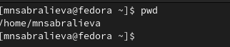{#fig:001 width=90%}

##
2.1 Так как я делаю на своем устройстве, то для начала создаю каталог tmp с помощью команды mkdir. Далее перехожу в него используя команду сd. 

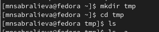{#fig:002 width=90%}

##
2.2 Выведим на экран содержимое каталога /tmp. Для этого используем команду ls с различными опциями. 

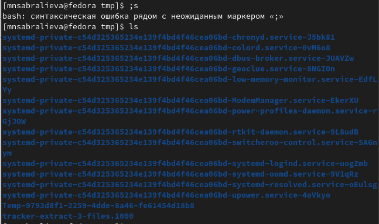{#fig:003 width=90%}

##
Мы можем увидеть содержимое каталога со скрытыми файлами применив опцию -а.

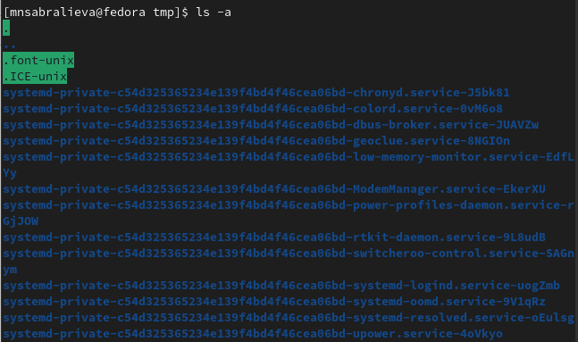{#fig:004 width=90%}

##
С помощью этой опции мы можем увидеть при помощи чего, когда был создан каталог
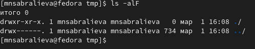{#fig:005 width=90%}

##
Мы можем увидеть подробное содержимое каталога применив -l

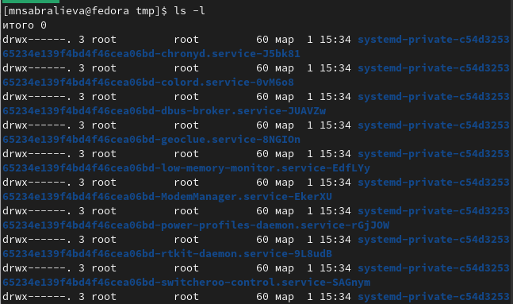{#fig:006 width=90%}

##
Применив опцию -f можем увидеть файлы списком 

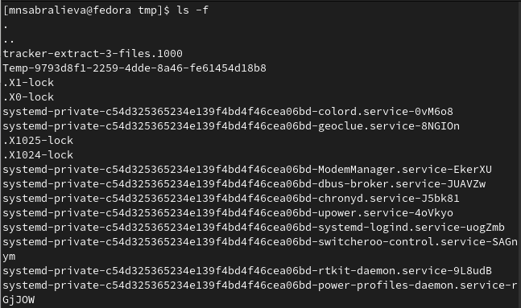{#fig:007 width=90%}

##
2.3 Определили, есть ли в каталоге /var/spool подкаталог с именем cron. Его нет 

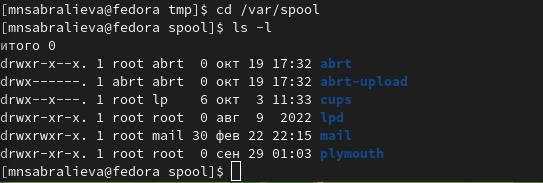{#fig:008 width=90%}

##
2.4 Перейдем в домашний каталог и выведем на экран его содержимое. Определим, кто является владельцем файлов и подкаталогов с помощью команд ls -al. Большинство файлов принадлежат моему пользователю root. 

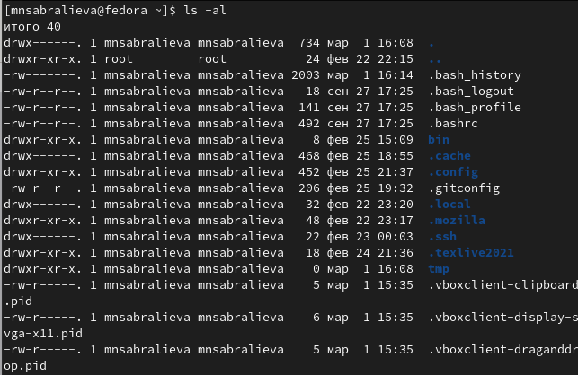{#fig:009 width=90%}

##
3. В домашнем каталоге создадим новый каталог с именем newdir. Перейдем в него и создадим новый каталог с именем morefun.В домашнем каталоге создадим одной командой три новых каталога с именами letters, memos, misk. С помощью команды ls посмотрим что у нас получилось 

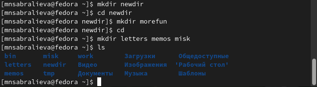{#fig:010 width=90%}

##
Пробуя удалить созданные каталоги мы понимаем, что только командой rm это не удается. Поэтому добавляем опцию -r и удаляем каталоги. Проверим удалились ли они 

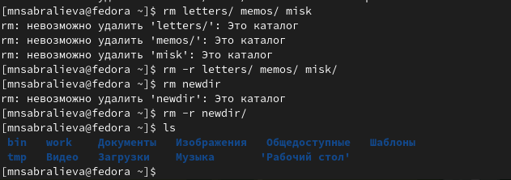{#fig:011 width=90%}

##
4. С помощью команды man определим, какую опцию команды ls нужно использо-
вать для просмотра содержимое не только указанного каталога, но и подкаталогов, входящих в него. Введя в консоли man ls мы получим справку на английском языке и в ней ключ -R
5. С помощью команды man определим набор опций команды ls, позволяющий отсортировать по времени последнего изменения выводимый список содержимого каталога с развёрнутым описанием файлов.Введя в консоли man ls мы получим справку на английском языке и в ней ключ -t. 

##
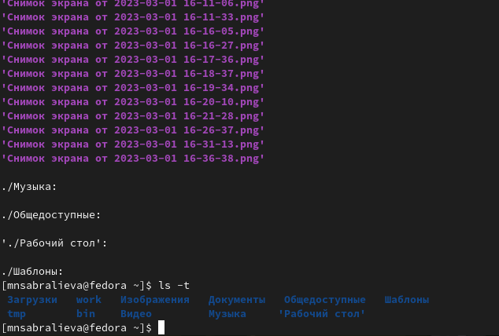{#fig:012 width=90%}

##
6. Используйте команду man для просмотра описания следующих команд: cd, pwd, mkdir, rmdir, rm.

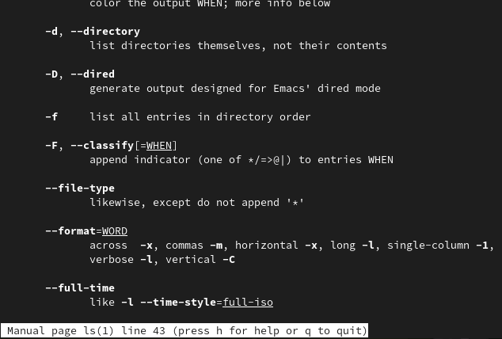{#fig:013 width=90%}

##
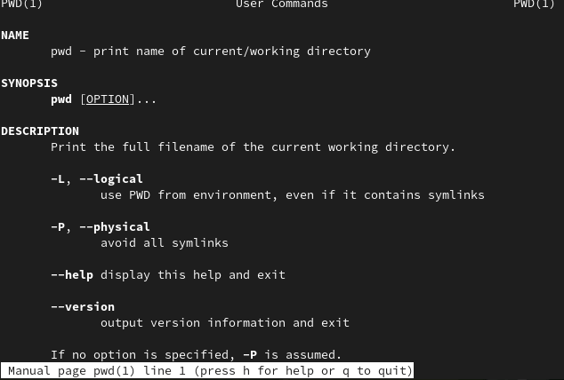{#fig:014 width=90%}

##
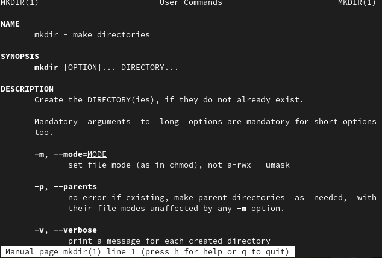{#fig:015 width=90%}

##
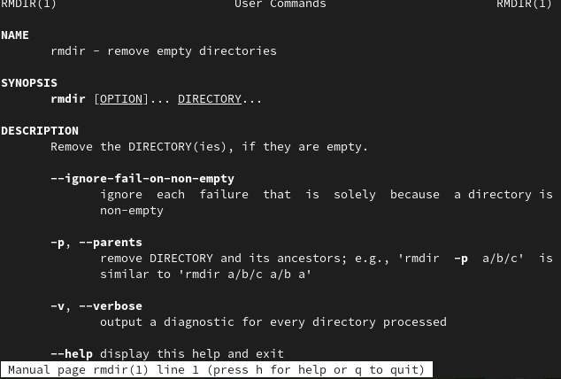{#fig:016 width=90%}

##
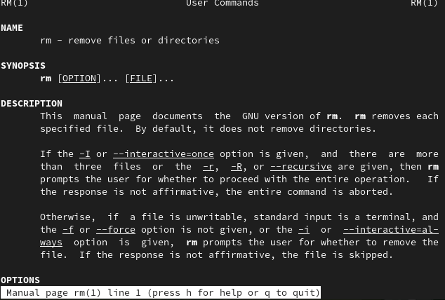{#fig:017 width=90%}

##
7. Используя информацию, полученную при помощи команды history, выполниv модификацию и исполнение нескольких команд из буфера команд. 

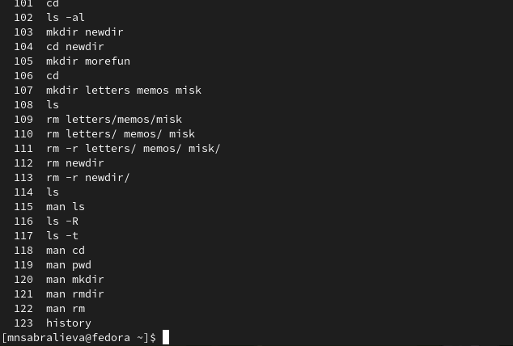{#fig:018 width=90%}

## Результаты

- Мы приобрели практические навыки взаимодействия пользователя с системой посредством командной строки

## Итоговый слайд

- Запоминается последняя фраза. © Штирлиц


:::

