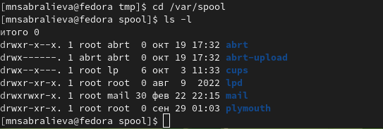

---
## Front matter
title: "Лабораторная работа №4"
subtitle: "Операционные системы"
author: "Сабралиева Марворид Нуралиевна"

## Generic otions
lang: ru-RU
toc-title: "Содержание"

## Bibliography
bibliography: bib/cite.bib
csl: pandoc/csl/gost-r-7-0-5-2008-numeric.csl

## Pdf output format
toc: true # Table of contents
toc-depth: 2
lof: true # List of figures
lot: true # List of tables
fontsize: 12pt
linestretch: 1.5
papersize: a4
documentclass: scrreprt
## I18n polyglossia
polyglossia-lang:
  name: russian
  options:
	- spelling=modern
	- babelshorthands=true
polyglossia-otherlangs:
  name: english
## I18n babel
babel-lang: russian
babel-otherlangs: english
## Fonts
mainfont: PT Serif
romanfont: PT Serif
sansfont: PT Sans
monofont: PT Mono
mainfontoptions: Ligatures=TeX
romanfontoptions: Ligatures=TeX
sansfontoptions: Ligatures=TeX,Scale=MatchLowercase
monofontoptions: Scale=MatchLowercase,Scale=0.9
## Biblatex
biblatex: true
biblio-style: "gost-numeric"
biblatexoptions:
  - parentracker=true
  - backend=biber
  - hyperref=auto
  - language=auto
  - autolang=other*
  - citestyle=gost-numeric
## Pandoc-crossref LaTeX customization
figureTitle: "Рис."
tableTitle: "Таблица"
listingTitle: "Листинг"
lofTitle: "Список иллюстраций"
lotTitle: "Список таблиц"
lolTitle: "Листинги"
## Misc options
indent: true
header-includes:
  - \usepackage{indentfirst}
  - \usepackage{float} # keep figures where there are in the text
  - \floatplacement{figure}{H} # keep figures where there are in the text
---

# Цель работы

Приобретение практических навыков взаимодействия пользователя с системой посредством командной строки.

# Теоретическое введение
В операционной системе типа Linux взаимодействие пользователя с системой обычно
осуществляется с помощью командной строки посредством построчного ввода ко-
манд. При этом обычно используется командные интерпретаторы языка shell: /bin/sh; /bin/csh; /bin/ksh.
Формат команды. Командой в операционной системе называется записанный по
специальным правилам текст (возможно с аргументами), представляющий собой указание на выполнение какой-либо функций (или действий) в операционной системе.
Обычно первым словом идёт имя команды, остальной текст — аргументы или опции,
конкретизирующие действие.
Общий формат команд можно представить следующим образом:
<имя_команды><разделитель><аргументы>
- Команда man. Команда man используется для просмотра (оперативная помощь) в диалоговом режиме руководства (manual) по основным командам операционной системытипа Linux.
Формат команды: man <команда>
-Команда cd. Команда cd используется для перемещения по файловой системе операционной системы типа Linux.
-Команда pwd. Для определения абсолютного пути к текущему каталогу используется команда pwd (print working directory).
-Команда ls. Команда ls используется для просмотра содержимого каталога.
-Команда mkdir. Команда mkdir используется для создания каталогов.
-Команда rm. Команда rm используется для удаления файлов и/или каталогов.
-Команда history. Для вывода на экран списка ранее выполненных команд используется команда history. Выводимые на экран команды в списке нумеруются. К любой команде из выведенного на экран списка можно обратиться по её номеру в списке, воспользовавшись конструкцией !<номер_команды>.

# Выполнение лабораторной работы

1. Определим полное имя нашего домашнего каталога. При помощи команды сd можно перейти в домашний каталог и с помощью команды pwd увидеть путь к нему. (рис. @fig:001).

{#fig:001 width=90%}

2.1 Так как я делаю на своем устройстве, то для начала создаю каталог tmp с помощью команды mkdir. Далее перехожу в него используя команду сd. (рис. @fig:002).

{#fig:002 width=90%}

2.2 Выведим на экран содержимое каталога /tmp. Для этого используем команду ls с различными опциями. (рис. @fig:003).

{#fig:003 width=90%}

Мы можем увидеть содержимое каталога со скрытыми файлами применив опцию -а.

{#fig:004 width=90%}

С помощью этой опции мы можем увидеть при помощи чего, когда был создан каталог
{#fig:005 width=90%}

Мы можем увидеть подробное содержимое каталога применив -l

{#fig:006 width=90%}

Применив опцию -f можем увидеть файлы списком 

{#fig:007 width=90%}

2.3 Определили, есть ли в каталоге /var/spool подкаталог с именем cron. Его нет (рис. @fig:008).

{#fig:008 width=90%}

2.4 Перейдем в домашний каталог и выведем на экран его содержимое. Определим, кто является владельцем файлов и подкаталогов с помощью команд ls -al. Большинство файлов принадлежат моему пользователю root. (рис. @fig:009).

{#fig:009 width=90%}

3. В домашнем каталоге создадим новый каталог с именем newdir. Перейдем в него и создадим новый каталог с именем morefun.В домашнем каталоге создадим одной командой три новых каталога с именами letters, memos, misk. С помощью команды ls посмотрим что у нас получилось (рис. @fig:010).

{#fig:010 width=90%}

Пробуя удалить созданные каталоги мы понимаем, что только командой rm это не удается. Поэтому добавляем опцию -r и удаляем каталоги. Проверим удалились ли они (рис. @fig:011).

{#fig:011 width=90%}

4. С помощью команды man определим, какую опцию команды ls нужно использо-
вать для просмотра содержимое не только указанного каталога, но и подкаталогов, входящих в него. Введя в консоли man ls мы получим справку на английском языке и в ней ключ -R
5. С помощью команды man определим набор опций команды ls, позволяющий отсортировать по времени последнего изменения выводимый список содержимого каталога с развёрнутым описанием файлов.Введя в консоли man ls мы получим справку на английском языке и в ней ключ -t. (рис. @fig:012).

{#fig:012 width=90%}

6. Используйте команду man для просмотра описания следующих команд: cd, pwd, mkdir, rmdir, rm.

{#fig:013 width=90%}

{#fig:014 width=90%}

{#fig:015 width=90%}

{#fig:016 width=90%}

{#fig:017 width=90%}

7. Используя информацию, полученную при помощи команды history, выполниv модификацию и исполнение нескольких команд из буфера команд. (рис. @fig:018).

{#fig:018 width=90%}
# Выводы

Мы приобрели практические навыки взаимодействия пользователя с системой посредством командной строки

# Контрольные вопросы

1. Что такое командная строка? Ответ: текстовый интерфейс взаимодействия
пользователя с системой
2. При помощи какой команды можно определить абсолютный путь текущего
каталога? Приведите пример. Ответ: команда pwd, пример:
• cd /var/www
• pwd
• /var/www/
3. При помощи какой команды и каких опций можно определить только тип
файлов и их имена в текущем каталоге? Приведите примеры. Ответ: команда ls с опцией -F.
4. Какие файлы считаются скрытыми? Как получить информацию о скрытых
файлах? Приведите примеры. Ответ: Некоторые файлы в операционной системе скрыты от просмотра и обычно используются для настройки рабочей
среды. Имена таких файлов начинаются с точки. информацию о них можно
получить с помощью команды ls с опцией -a.
5. При помощи каких команд можно удалить файл и каталог? Можно ли это
сделать одной и той же командой? Ответ: С помощью команды rm можно удалить как отдельный файл так и целый каталог, в случае каталога
необходимо указать опцию -r.
6. Как определить, какие команды выполнил пользователь в сеансе работы?
Ответ: с помощью команды history.
7. Каким образом можно исправить и запустить на выполнение команду, которую пользователь уже использовал в сеансе работы? Приведите примеры
Ответ: узнать порядковый номер этой команды с помощью history затем
изменить её сл. образом: !:s//
8. Можно ли в одной строке записать несколько команд? Если да, то как?
Приведите примеры
Ответ: да, можно, необходимо разделить команды символом точки с запятой в
таком случае они будут выполняться последовательно в том порядке, в котором
они записаны пример: cd /tmp/; ls -l;pwd
9. Что такое символ экранирования? Приведите примеры использования этого
символа. Ответ: символ экранирования (обратный слэш) - символ, экранирующие управляющие конструкции и символы в названии файлов и папок
Пример: ls /etc/nginx
10. Какая информация выводится на экран о файлах и каталогах, если используется опция l в команде ls? Ответ: тип файла, право доступа, число ссылок,
владелец, размер, дата последней ревизии, имя файла или каталога.
11. Что такое относительный путь к файлу? Приведите примеры использования
относительного и абсолютного пути при выполнении какой-либо команды.
Ответ: относительный путь - путь к тому или иному файлу или директории
относительной текущей рабочей директории, пример: папка /www/ в директории /var/ абсолютный путь: /var/www/ относительный путь(если рабочая
директория - /var/): /www/
12. Как получить информацию об интересующей вас команде? Ответ: можно
попробовать найти информацию по использованию с помощью утилиты
man, или попробовать ввести опцию –help.

# Список литературы{.unnumbered}

::: {#refs}
:::
