---
## Front matter
lang: ru-RU
title: Лабораторная работа №5
subtitle: Операционные системы
author:
  - Сабралиева М. Н.
institute:
  - Российский университет дружбы народов, Москва, Россия

## i18n babel
babel-lang: russian
babel-otherlangs: english

## Formatting pdf
toc: false
toc-title: Содержание
slide_level: 2
aspectratio: 169
section-titles: true
theme: metropolis
header-includes:
 - \metroset{progressbar=frametitle,sectionpage=progressbar,numbering=fraction}
 - '\makeatletter'
 - '\beamer@ignorenonframefalse'
 - '\makeatother'
---

# Информация

## Докладчик

:::::::::::::: {.columns align=center}
::: {.column width="70%"}

  * Сабралиева Марворид Нуралиевна
  * студент направления бизнес- информатика
  * Российский университет дружбы народ
  
:::
::::::::::::::

# Вводная часть

## Цели и задачи

Ознакомление с файловой системой Linux, её структурой, именами и содержанием каталогов. Приобретение практических навыков по применению команд для работы с файлами и каталогами, по управлению процессами (и работами), по проверке использования диска и обслуживанию файловой системы

## Материалы и методы

- Процессор `pandoc` для входного формата Markdown
- Результирующие форматы
	- `pdf`
	- `html`
- Автоматизация процесса создания: `Makefile`

# Создание презентации

## Процессор `pandoc`

- Pandoc: преобразователь текстовых файлов
- Сайт: <https://pandoc.org/>
- Репозиторий: <https://github.com/jgm/pandoc>

## Формат `pdf`

- Использование LaTeX
- Пакет для презентации: [beamer](https://ctan.org/pkg/beamer)
- Тема оформления: `metropolis`

## Код для формата `pdf`

```yaml
slide_level: 2
aspectratio: 169
section-titles: true
theme: metropolis
```

## Формат `html`

- Используется фреймворк [reveal.js](https://revealjs.com/)
- Используется [тема](https://revealjs.com/themes/) `beige`

## Код для формата `html`

- Тема задаётся в файле `Makefile`

```make
REVEALJS_THEME = beige 
```
# Результаты

## Получающиеся форматы

- Полученный `pdf`-файл можно демонстрировать в любой программе просмотра `pdf`
- Полученный `html`-файл содержит в себе все ресурсы: изображения, css, скрипты

# Элементы презентации


## Цели и задачи

- Ознакомление с файловой системой Linux, её структурой, именами и содержанием каталогов. Приобретение практических навыков по применению команд для работы с файлами и каталогами, по управлению процессами (и работами), по проверке использования диска и обслуживанию файловой системы

## Содержание исследования

1. Выполните все примеры, приведённые в первой части описания лабораторной работы (рис. @fig:001).

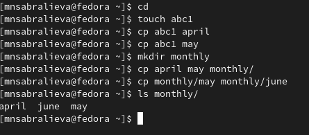{#fig:001 width=90%}

##

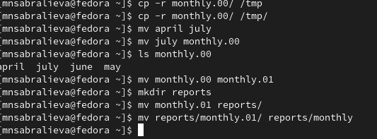{#fig:002 width=90%}

##

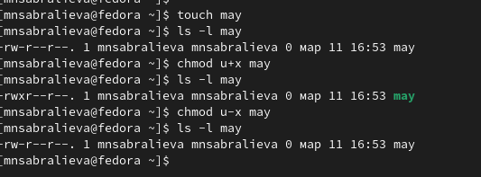{#fig:003 width=90%}

##

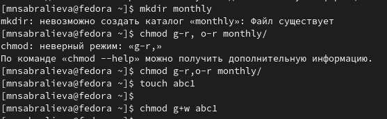{#fig:004 width=90%}

##

2.1. Скопируем файл /usr/include/sys/io.h в домашний каталог и назовем его equipment.
2.2- 2.5  В домашнем каталоге создаем директорию ski.plases и перемещаем в него файл equipment. Переименуем plases/equipment в ski.plases/equiplist. Создадим в домашнем каталоге файл abc1 и скопируем его в каталог ski.plase с названием equiplist2 (рис. @fig:005).

##

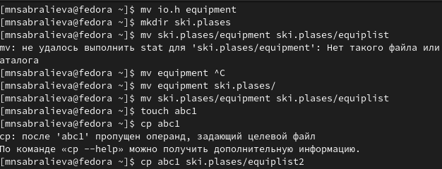{#fig:005 width=90%}

##

2.6-2.8 Создадим каталог с именем equipment в каталоге ski.plases и переместимв него файлы ski.plases/equiplist и equiplist2. Создадим и переместим каталог newdir в каталог ski.plases и назовем его plans (рис. @fig:006).

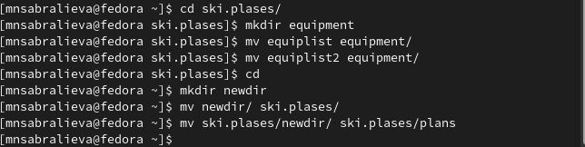{#fig:006 width=90%}

##

3. Определим опции команды chmod, необходимые для того, чтобы присвоить перечисленным ниже файлам выделенные права доступа.
а) (drwxr--r-) australia
б) (drwx--x--x) play
в) (-r-xr--r-) my_os
г) (-rw-rw-r-) feathers (рис. @fig:007).

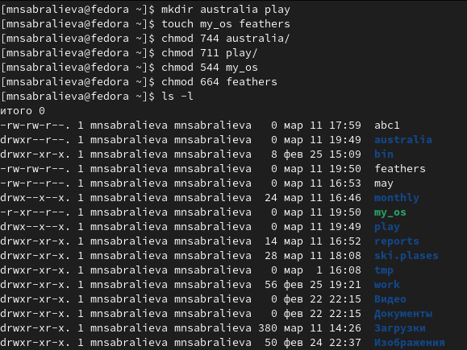{#fig:007 width=90%}

##

4.1 Просмотрим содержимое файла /etc/password (рис. @fig:008).

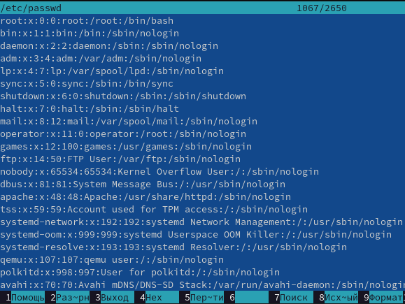{#fig:008 width=90%}

##

4.2.-4.5 Скопируем файл feathers в файл file.old и переместите файл file.old в каталог play.Скопируем каталог play в каталог fun. Переместим каталог fun в каталог play и назовеем его games.
4.6. Лишим владельца файла ~/feathers права на чтение.
4.7. Что произойдёт, если мы попытаемся просмотреть файл feathers командой
cat? Ответ: нам будет отказано в доступе
4.8. Что произойдёт, если вы попытаетесь скопировать файл feathers? Ответ: нам будет отказано в доступе, так как мы ограничили себя в доступе для чтения (рис. @fig:009).

##

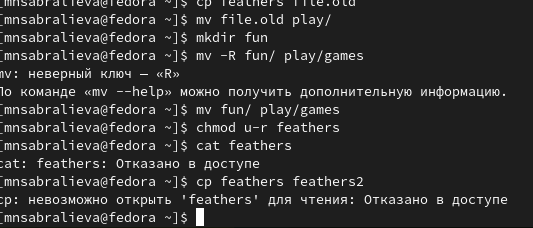{#fig:009 width=90%}

##

4.9.-4.11. Дадим владельцу файла feathers право на чтение. Лишим владельца каталога play права на выполнение и перейдем в каталог play. Что произошло? Ответ: нам отказано в доступе
4.12. Вернем владельцу каталога play право на выполнение. (рис. @fig:010).

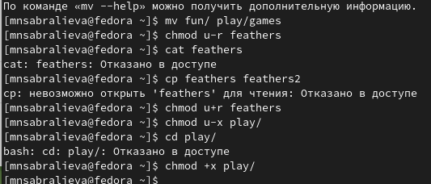{#fig:010 width=90%}

##

5. Прочитаем man по командам mount, fsck, mkfs, kill. (рис. @fig:011).

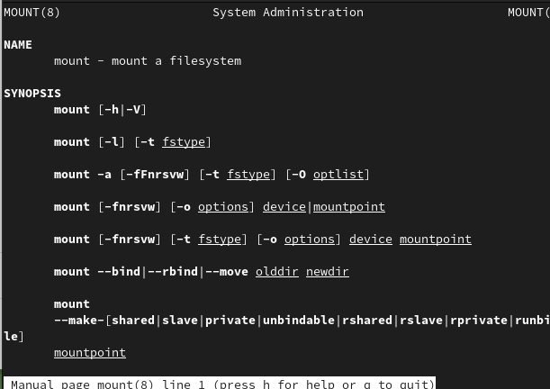{#fig:011 width=90%}

##

Монтирование файловой системы к общему дереву каталогов. Для размонтирования используется команда unmonnt.

##

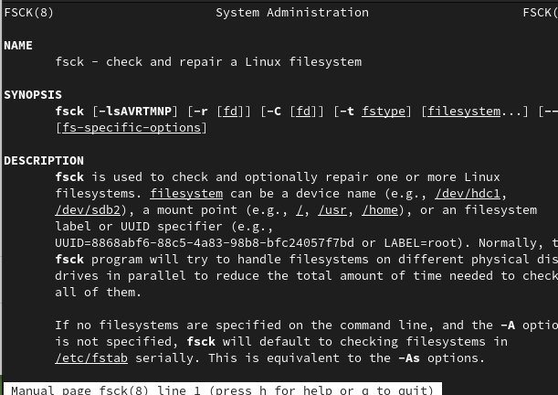{#fig:012 width=90%}

##

fsck (проверка файловой системы) – это утилита командной строки, которая позволяет выполнять проверки согласованности и интерактивное исправление в одной или нескольких файловых системах Linux. Она использует программы, специфичные для типа файловой системы, которую она проверяет. Вы можете использовать команду fsck для восстановления поврежденных файловых систем в ситуациях, когда система не загружается или раздел не может быть смонтирован.

##

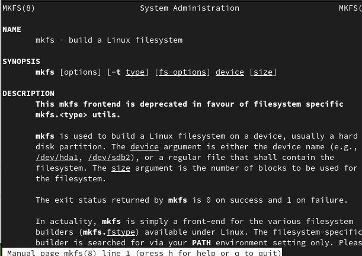{#fig:013 width=90%}

##

Буквы в mkfs значке означают “make file system” (создать файловую систему). Команда обычно используется для управления устройствами хранения в Linux. Вы можете рассматривать mkfs как инструмент командной строки для форматирования диска в определенной файловой системе.

##

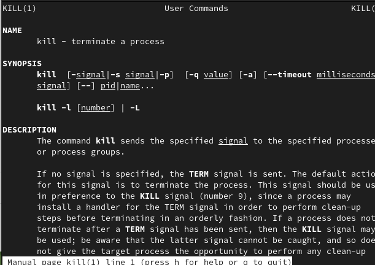{#fig:014 width=90%}

Системный вызов kill может быть использован для посылки какого-либо сигнала какому-либо процессу или группе процесса.

## Результаты


- В ходе данной работы мы ознакомились с файловой системой Linux, её структурой, именами и содержанием каталогов. Научились совершать базовые операции с файлами, управлять правами их доступа для пользователя и групп. Ознакомились с Анализом файловой системы. А также получили базовые навыки по проверке использования диска и обслуживанию файловой системы.


## Итоговый слайд

- Запоминается последняя фраза. © Штирлиц


:::

