---
## Front matter
lang: ru-RU
title: Лабораторная работа №6
subtitle: Операционные системы
author:
  - Сабралиева М. Н.
institute:
  - Российский университет дружбы народов, Москва, Россия

## i18n babel
babel-lang: russian
babel-otherlangs: english

## Formatting pdf
toc: false
toc-title: Содержание
slide_level: 2
aspectratio: 169
section-titles: true
theme: metropolis
header-includes:
 - \metroset{progressbar=frametitle,sectionpage=progressbar,numbering=fraction}
 - '\makeatletter'
 - '\beamer@ignorenonframefalse'
 - '\makeatother'
---

# Информация

## Докладчик

:::::::::::::: {.columns align=center}
::: {.column width="70%"}

  * Сабралиева Марворид Нуралиевна
  * студент направления бизнес-информатика кафедры прикладной информатики и теории вероятностей
  * Российский университет дружбы народов

:::
::::::::::::::


## Материалы и методы

- Процессор `pandoc` для входного формата Markdown
- Результирующие форматы
	- `pdf`
	- `html`
- Автоматизация процесса создания: `Makefile`

# Создание презентации

## Процессор `pandoc`

- Pandoc: преобразователь текстовых файлов
- Сайт: <https://pandoc.org/>
- Репозиторий: <https://github.com/jgm/pandoc>

## Формат `pdf`

- Использование LaTeX
- Пакет для презентации: [beamer](https://ctan.org/pkg/beamer)
- Тема оформления: `metropolis`

## Код для формата `pdf`

```yaml
slide_level: 2
aspectratio: 169
section-titles: true
theme: metropolis
```

## Формат `html`

- Используется фреймворк [reveal.js](https://revealjs.com/)
- Используется [тема](https://revealjs.com/themes/) `beige`

## Код для формата `html`

- Тема задаётся в файле `Makefile`

```make
REVEALJS_THEME = beige 
```
# Результаты

## Получающиеся форматы

- Полученный `pdf`-файл можно демонстрировать в любой программе просмотра `pdf`
- Полученный `html`-файл содержит в себе все ресурсы: изображения, css, скрипты

# Элементы презентации

## Цели и задачи

- Ознакомление с инструментами поиска файлов и фильтрации текстовых данных.
- Приобретение практических навыков: по управлению процессами (и заданиями), по проверке использования диска и обслуживанию файловых систем.

## Содержание исследования

##

1. Включаем компьютер и входим в  свою учетную запись.
2. Запишем в файл file.txt названия файлов, содержащихся в каталоге etc. Допишем в этот же файл названия файлов, содержащихся в нашем домашнем каталоге (рис. @fig:001).

##

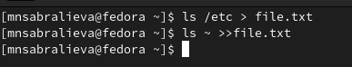{#fig:001 width=90%}

##
3. Выведем имена всех файлов из file.txt, имеющих расширение .conf, после чего запишем их в новый текстовой файл conf.txt.

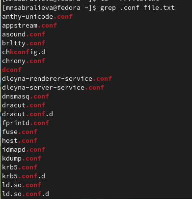{#fig:002 width=90%}

##

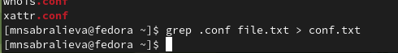{#fig:003 width=90%}

##

4. Определим, какие файлы в нашем домашнем каталоге имеют имена, начинавшиеся с символа c? Используем несколько вариантов, как это сделать

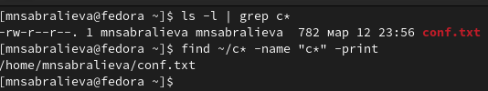{#fig:004 width=90%}

##

5. Выведим на экран (по странично) имена файлов из каталога etc, начинающиеся с символа h

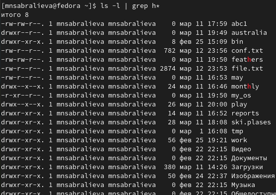{#fig:005 width=90%}

##

6. Запустим в фоновом режиме процесс, который будет записывать в файл ~/logfile файлы, имена которых начинаются с log.
7. Удалим файл ~/logfile.

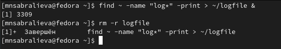{#fig:006 width=90%}

##

8. Запустим из консоли в фоновом режиме редактор gedit.

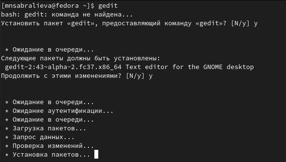{#fig:007 width=90%}

##

9. Определите идентификатор процесса gedit, используя команду ps, конвейер и фильтр grep. 

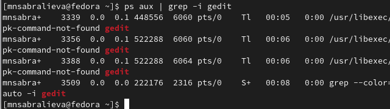{#fig:008 width=90%}

##

10. Прочтем справку (man) команды kill, 

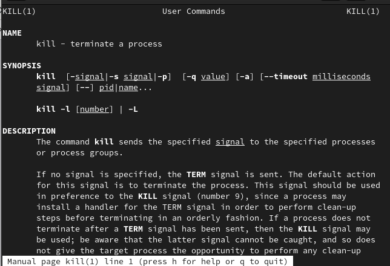{#fig:009 width=90%}

##

после чего используем её для завершения процесса gedit

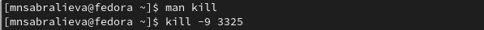{#fig:010 width=90%}

##

11. Выполним команды df и du, предварительно получив более подробную информацию об этих командах, с помощью команды man

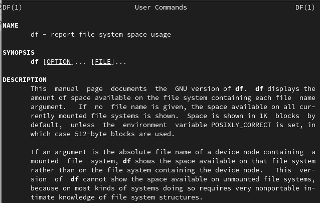{#fig:011 width=90%}

##

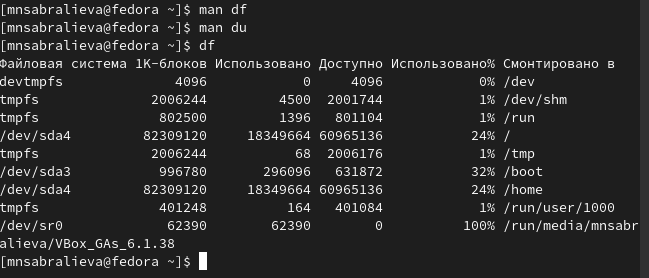{#fig:012 width=90%}

##

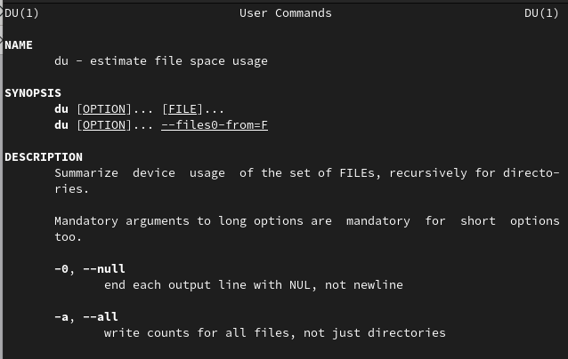{#fig:013 width=90%}

##

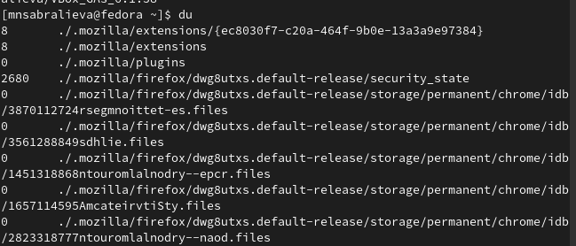{#fig:014 width=90%}

##

12. Воспользовавшись справкой команды find, выведиv имена всех директорий, имеющихся в нашем домашнем каталоге.

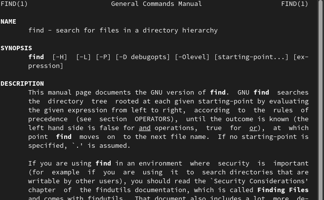{#fig:015 width=90%}

##

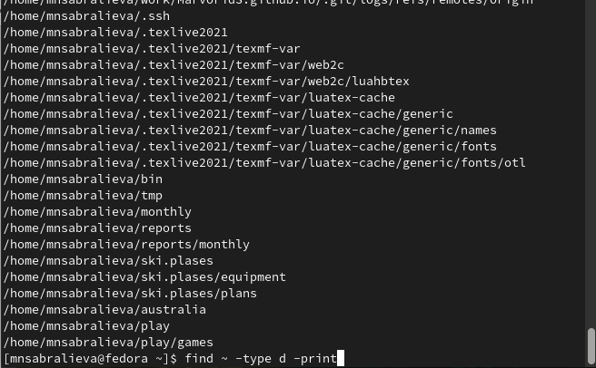{#fig:016 width=90%}

## Результаты

- Мы ознакомились с инструментами поиска файлов и фильтрации текстовых данных и приобрели практические навыки: по управлению процессами (и заданиями), по проверке использования диска и обслуживанию файловых систем.


## Итоговый слайд

- Запоминается последняя фраза. © Штирлиц
:::

