---
## Front matter
lang: ru-RU
title: Лабораторная работа №7
subtitle: Операционные системы
author:
  - Сабралиева М. Н.
institute:
  - Российский университет дружбы народов, Москва, Россия

## i18n babel
babel-lang: russian
babel-otherlangs: english

## Formatting pdf
toc: false
toc-title: Содержание
slide_level: 2
aspectratio: 169
section-titles: true
theme: metropolis
header-includes:
 - \metroset{progressbar=frametitle,sectionpage=progressbar,numbering=fraction}
 - '\makeatletter'
 - '\beamer@ignorenonframefalse'
 - '\makeatother'
---

# Информация

## Докладчик

:::::::::::::: 
  * Сабралиева Марворид Нуралиевна
  * студент направления бизнес-информатика кафедры прикладной информатики и теории вероятностей
  * Российский университет дружбы народов

:::
::::::::::::::

# Вводная часть

## Материалы и методы

- Процессор `pandoc` для входного формата Markdown
- Результирующие форматы
	- `pdf`
	- `html`
- Автоматизация процесса создания: `Makefile`

# Создание презентации

## Процессор `pandoc`

- Pandoc: преобразователь текстовых файлов
- Сайт: <https://pandoc.org/>
- Репозиторий: <https://github.com/jgm/pandoc>

## Формат `pdf`

- Использование LaTeX
- Пакет для презентации: [beamer](https://ctan.org/pkg/beamer)
- Тема оформления: `metropolis`

## Код для формата `pdf`

```yaml
slide_level: 2
aspectratio: 169
section-titles: true
theme: metropolis
```

## Формат `html`

- Используется фреймворк [reveal.js](https://revealjs.com/)
- Используется [тема](https://revealjs.com/themes/) `beige`

## Код для формата `html`

- Тема задаётся в файле `Makefile`

```make
REVEALJS_THEME = beige 
```
# Результаты

## Цели и задачи

- Освоение основных возможностей командной оболочки Midnight Commander. 
- Приобретение навыков практической работы по просмотру каталогов и файлов; манипуляций с ними.

## Содержание исследования

1. Изучим информацию о mc, вызвав в командной строке man mc. (рис. @fig:001).

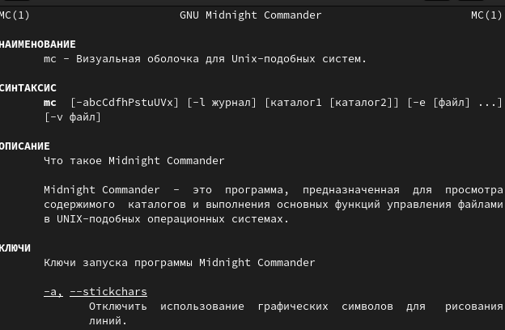{#fig:001 width=90%}

##

2. Запустим из командной строки mc, изучим его структуру и меню. (рис. @fig:002).

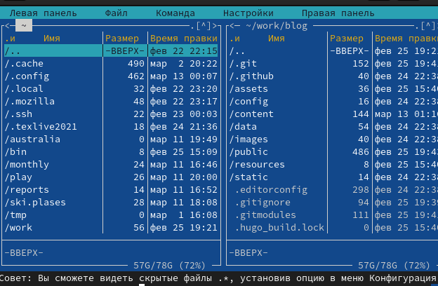{#fig:002 width=90%}

##

3. Выполните несколько операций в mc, используя управляющие клавиши , операции с панелями; 

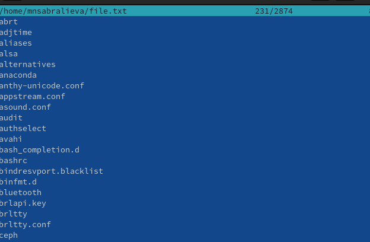{#fig:003 width=90%}

##

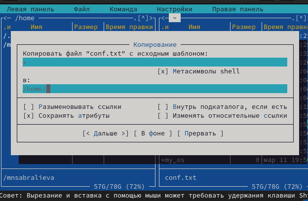{#fig:004 width=90%}

##

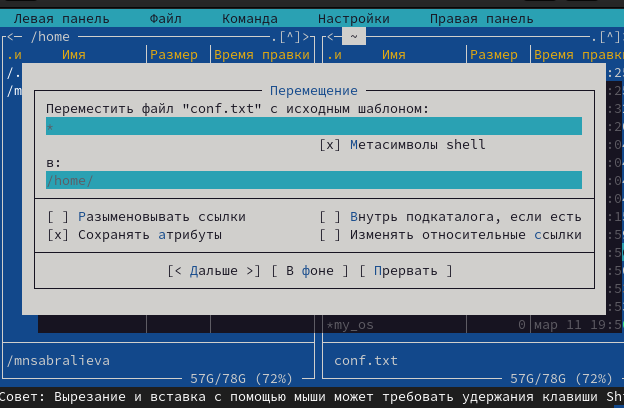{#fig:005 width=90%}

##

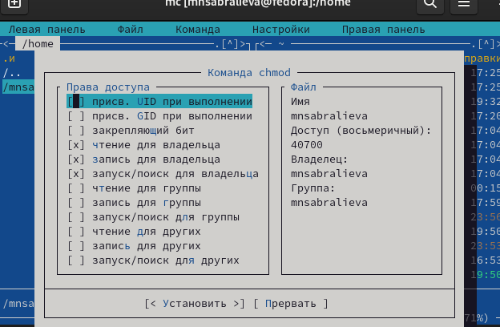{#fig:006 width=90%}

##

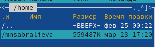{#fig:007 width=90%}

##

4. Выполните основные команды меню левой (или правой) панели. Оцените степень подробности вывода информации о файлах.

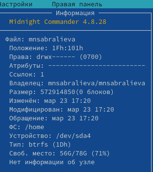{#fig:008 width=90%}

##

5. Используя возможности подменю Файл , выполните:

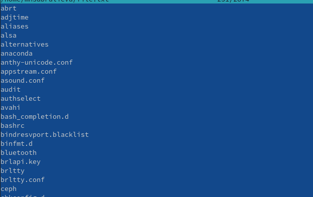{#fig:009 width=90%}

##

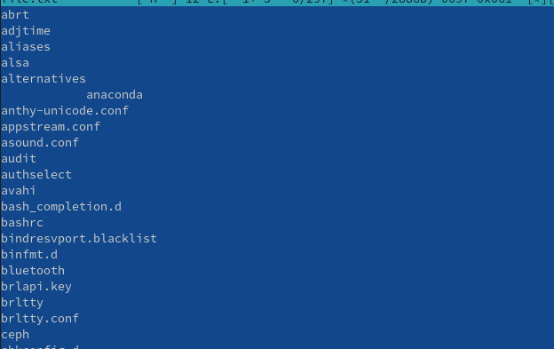{#fig:010 width=90%}

##

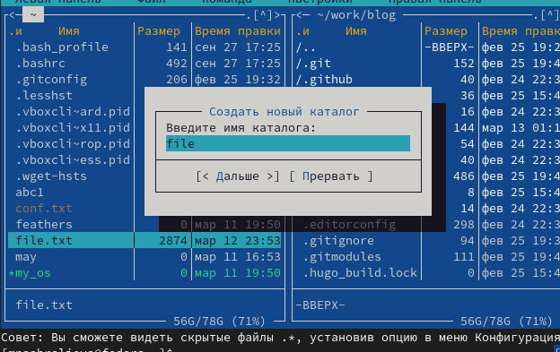{#fig:011 width=90%}

##

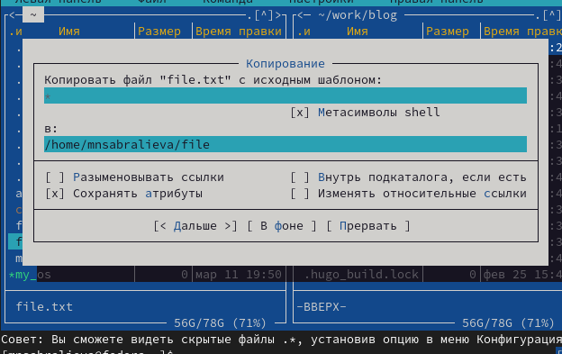{#fig:012 width=90%}

##

6. С помощью соответствующих средств подменю Команда осуществите:

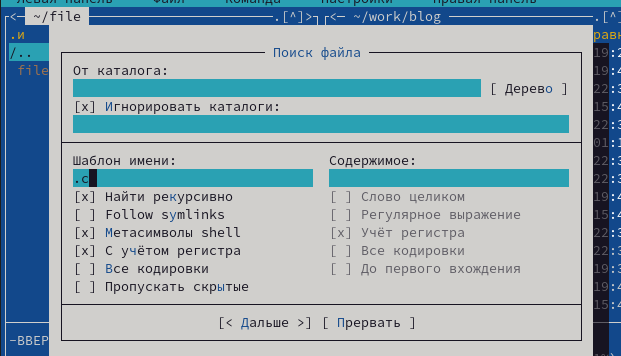{#fig:013 width=90%}

##

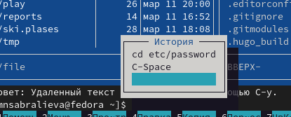{#fig:014 width=90%}

##

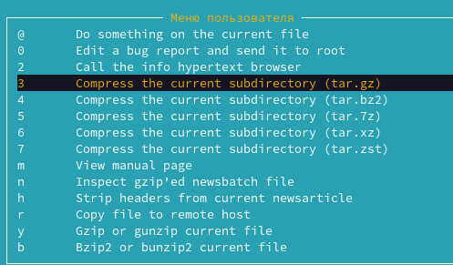{#fig:015 width=90%}

##

{#fig:015 width=90%}

##

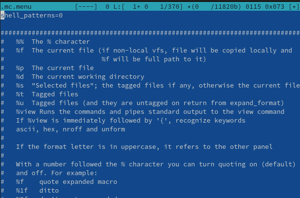{#fig:016 width=90%}

##

1. Создайте текстовой файл text.txt.

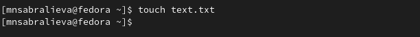{#fig:017 width=90%}

##

2. Откройте этот файл с помощью встроенного в mc редактора.

{#fig:018 width=90%}

##

3. Вставьте в открытый файл небольшой фрагмент текста, скопированный из любого другого файла или Интернета.

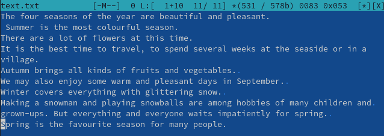{#fig:019 width=90%}

##

4. Проделайте с текстом следующие манипуляции, используя горячие клавиши:

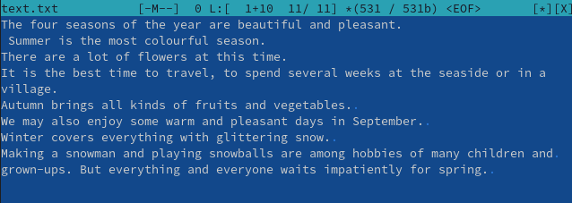{#fig:020 width=90%}

##

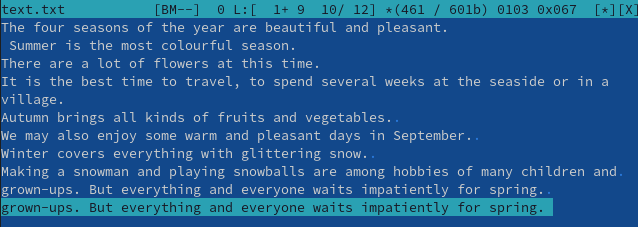{#fig:021 width=90%}

##

Перейдите в конец файла (нажав комбинацию клавиш) и напишите некоторый
текст. Перейдите в начало файла (нажав комбинацию клавиш) и напишите некоторый текст.

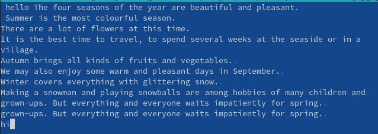{#fig:022 width=90%}

##

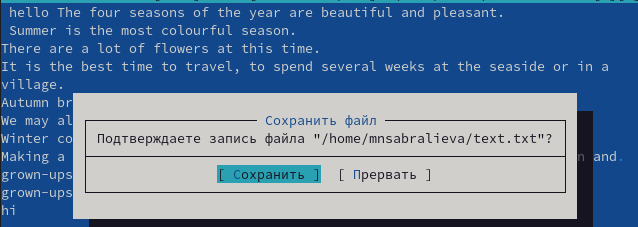{#fig:023 width=90%}

## Результаты

Мы освоили основные возможности командной оболочки Midnight Commander. Приобрели навыки практической работы по просмотру каталогов и файлов; манипуляций с ними

## Итоговый слайд

- Запоминается последняя фраза. © Штирлиц
:::

## Количество сущностей

::: incremental

- Человек может одновременно помнить $7 \pm 2$ элемента
- При размещении информации на слайде старайтесь чтобы в сумме слайд содержал не более 5 элементов
- Можно группировать элементы так, чтобы визуально было не более 5 групп

:::

## Общие рекомендации

::: incremental

- На слайд выносится та информация, которая без зрительной опоры воспринимается хуже
- Слайды должны дополнять или обобщать содержание выступления или его частей, а не дублировать его
- Информация на слайдах должна быть изложена кратко, чётко и хорошо структурирована
- Слайд не должен быть перегружен графическими изображениями и текстом
- Не злоупотребляйте анимацией и переходами

:::

## Представление данных

::: incremental

- Лучше представить в виде схемы
- Менее оптимально представить в виде рисунка, графика, таблицы
- Текст используется, если все предыдущие способы отображения информации не подошли

:::

