---
## Front matter
title: "Лабораторная работа №7"
subtitle: "Операционные системы"
author: "Сабралиева Марворид"

## Generic otions
lang: ru-RU
toc-title: "Содержание"

## Bibliography
bibliography: bib/cite.bib
csl: pandoc/csl/gost-r-7-0-5-2008-numeric.csl

## Pdf output format
toc: true # Table of contents
toc-depth: 2
lof: true # List of figures
lot: true # List of tables
fontsize: 12pt
linestretch: 1.5
papersize: a4
documentclass: scrreprt
## I18n polyglossia
polyglossia-lang:
  name: russian
  options:
	- spelling=modern
	- babelshorthands=true
polyglossia-otherlangs:
  name: english
## I18n babel
babel-lang: russian
babel-otherlangs: english
## Fonts
mainfont: PT Serif
romanfont: PT Serif
sansfont: PT Sans
monofont: PT Mono
mainfontoptions: Ligatures=TeX
romanfontoptions: Ligatures=TeX
sansfontoptions: Ligatures=TeX,Scale=MatchLowercase
monofontoptions: Scale=MatchLowercase,Scale=0.9
## Biblatex
biblatex: true
biblio-style: "gost-numeric"
biblatexoptions:
  - parentracker=true
  - backend=biber
  - hyperref=auto
  - language=auto
  - autolang=other*
  - citestyle=gost-numeric
## Pandoc-crossref LaTeX customization
figureTitle: "Рис."
tableTitle: "Таблица"
listingTitle: "Листинг"
lofTitle: "Список иллюстраций"
lotTitle: "Список таблиц"
lolTitle: "Листинги"
## Misc options
indent: true
header-includes:
  - \usepackage{indentfirst}
  - \usepackage{float} # keep figures where there are in the text
  - \floatplacement{figure}{H} # keep figures where there are in the text
---

# Цель работы

Освоение основных возможностей командной оболочки Midnight Commander. Приобретение навыков практической работы по просмотру каталогов и файлов; манипуляций с ними.

# Выполнение лабораторной работы

1. Изучим информацию о mc, вызвав в командной строке man mc. (рис. @fig:001).

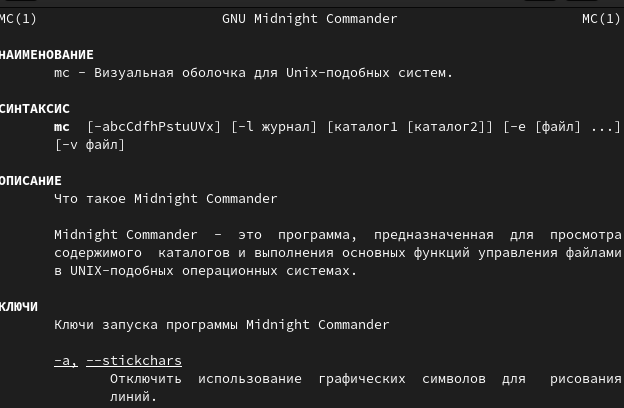{#fig:001 width=90%}

2. Запустим из командной строки mc, изучим его структуру и меню. (рис. @fig:002).

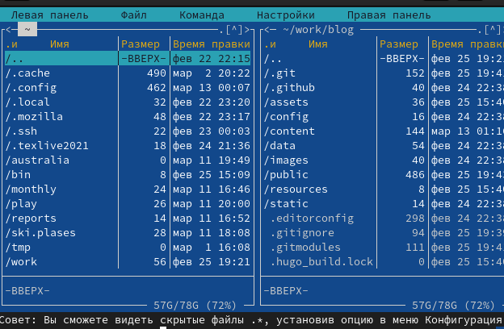{#fig:002 width=90%}

3. Выполните несколько операций в mc, используя управляющие клавиши , операции с панелями; 

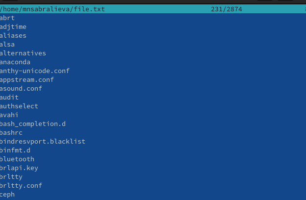{#fig:003 width=90%}

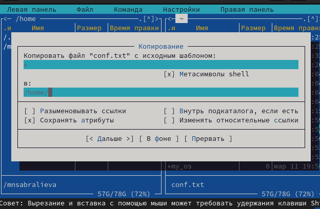{#fig:004 width=90%}

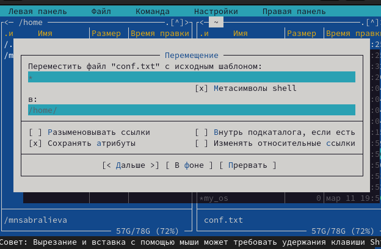{#fig:005 width=90%}

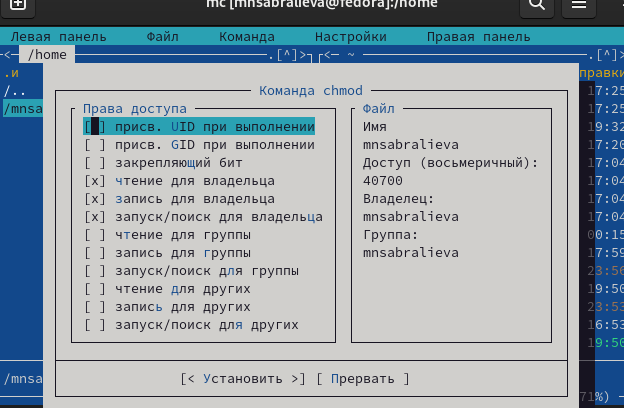{#fig:006 width=90%}

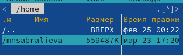{#fig:007 width=90%}

4. Выполните основные команды меню левой (или правой) панели. Оцените степень подробности вывода информации о файлах.

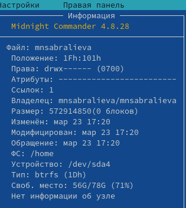{#fig:008 width=90%}

5. Используя возможности подменю Файл , выполните:

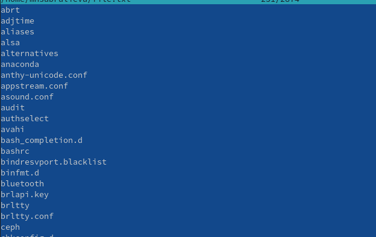{#fig:009 width=90%}

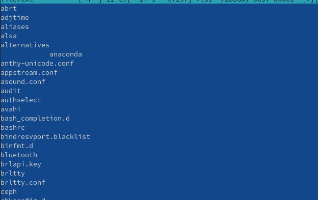{#fig:010 width=90%}

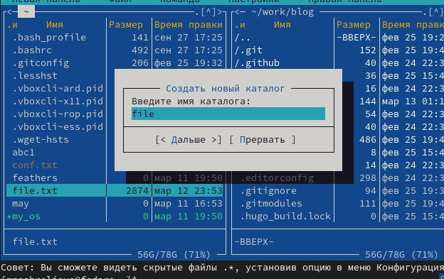{#fig:011 width=90%}

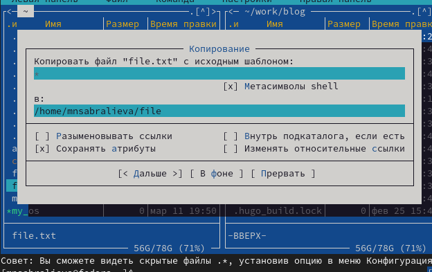{#fig:012 width=90%}

6. С помощью соответствующих средств подменю Команда осуществите:

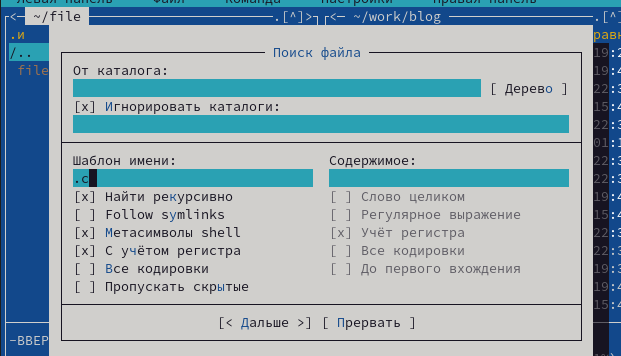{#fig:013 width=90%}

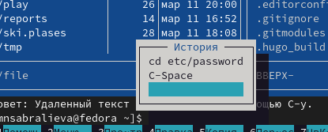{#fig:014 width=90%}

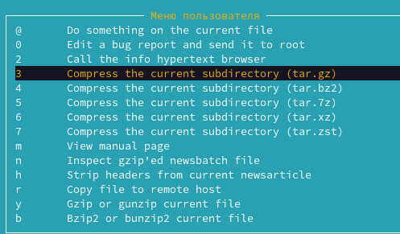{#fig:015 width=90%}

{#fig:015 width=90%}

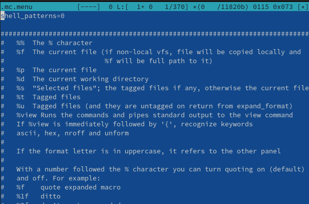{#fig:016 width=90%}

1. Создайте текстовой файл text.txt.

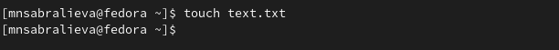{#fig:017 width=90%}

2. Откройте этот файл с помощью встроенного в mc редактора.

{#fig:018 width=90%}

3. Вставьте в открытый файл небольшой фрагмент текста, скопированный из любого
другого файла или Интернета.

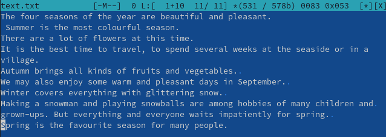{#fig:019 width=90%}

4. Проделайте с текстом следующие манипуляции, используя горячие клавиши:

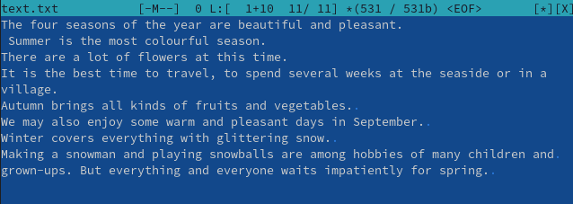{#fig:020 width=90%}

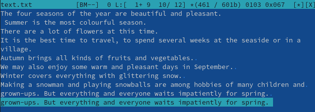{#fig:021 width=90%}

Перейдите в конец файла (нажав комбинацию клавиш) и напишите некоторый
текст. Перейдите в начало файла (нажав комбинацию клавиш) и напишите некоторый
текст.

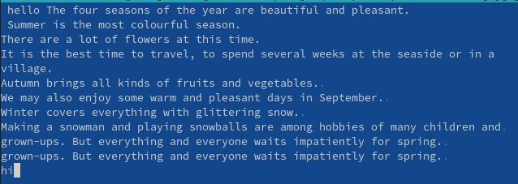{#fig:022 width=90%}

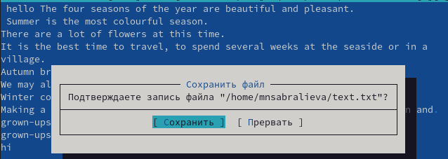{#fig:023 width=90%}

# Выводы

Мы освоили основные возможности командной оболочки Midnight Commander. Приобрели навыки практической работы по просмотру каталогов и файлов; манипуляций с ними.

# Список литературы{.unnumbered}

::: {#refs}
:::
