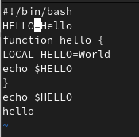

---
## Front matter
lang: ru-RU
title: Презентация по лабораторной работе №8
subtitle: Операционные системы
author:
  - Сабралиева М. Н.
institute:
  - Российский университет дружбы народов, Москва, Россия

## i18n babel
babel-lang: russian
babel-otherlangs: english

## Formatting pdf
toc: false
toc-title: Содержание
slide_level: 2
aspectratio: 169
section-titles: true
theme: metropolis
header-includes:
 - \metroset{progressbar=frametitle,sectionpage=progressbar,numbering=fraction}
 - '\makeatletter'
 - '\beamer@ignorenonframefalse'
 - '\makeatother'
---

# Информация

## Докладчик

:::::::::::::: {.columns align=center}
::: {.column width="70%"}

  * Сабралиева Марворид Нуралиевна
  * студент НБИбд-02-22 кафедры прикладной информатики и теории вероятностей
  * Российский университет дружбы народов


:::
::::::::::::::

# Вводная часть


## Материалы и методы

- Процессор `pandoc` для входного формата Markdown
- Результирующие форматы
	- `pdf`
	- `html`
- Автоматизация процесса создания: `Makefile`

# Создание презентации


## Код для формата `pdf`

```yaml
slide_level: 2
aspectratio: 169
section-titles: true
theme: metropolis
```

## Код для формата `html`

- Тема задаётся в файле `Makefile`

```make
REVEALJS_THEME = beige 
```
# Элементы презентации

## Цели и задачи

- Познакомиться с операционной системой Linux. 
- Получить практические навыки рабо-ты с редактором vi

## Содержание исследования

1. Создайте каталог с именем ~/work/os/lab06. 

{#fig:001 width=90%}

##

2. Перейдем во вновь созданный каталог и вызовем vi и создадим файл hello.sh 

{#fig:002 width=90%}

##

3. Нажимаем клавишу i и вводим следующий текст. для перехода в командный режим после завершения ввода текста нажимаем клавишу Esc 

{#fig:003 width=90%}

##

4. Для перехода в режим последней строки нажмите : и внизу вашего экрана появится приглашение в виде двоеточия.Нажмите w (записать) и q (выйти), а затем нажмите клавишу Enter для сохранения вашего текста и завершения работы.

##

{#fig:004 width=90%} 

##

5. Сделаем файл исполняемым 

{#fig:005 width=90%} 

##

6. Вызовите vi на редактирование файла и установим курсор в конец слова HELL второй строки. 

{#fig:006 width=90%}

##

7. Перейдем в режим вставки и заменим на HELLO. Нажимаем Esc для возврата в командный режим.

{#fig:007 width=90%}

##

8. Установим курсор на четвертую строку и сотрите слово LOCAL. Перейдем в режим вставки и наберем следующий текст: local, нажмите Esc для возврата в командный режим.Установим курсор на последней строке файла. Вставим после неё строку, содержащую следующий текст: echo $HELLO  Нажмите Esc для перехода в командный режим. 

{#fig:008 width=90%}

##

9. Удалим последнюю строку. Введем команду отмены изменений u для отмены последней команды, то есть вернем удаленную строку. Введем символ : для перехода в режим последней строки. Запише произведённые изменения, нажав w и q и выйдем из vi. 

{#fig:009 width=90%}

## Результаты

- Познакомились с операционной системой Linux. 
- Получили практические навыки работы с редактором vi,


## Итоговый слайд

- Запоминается последняя фраза. © Штирлиц
:::

