---
## Front matter
lang: ru-RU
title: Лабораторная работа №9
subtitle: Операционные системы
author:
  - Сабралиева М. Н.
institute:
  - Российский университет дружбы народов, Москва, Россия

## i18n babel
babel-lang: russian
babel-otherlangs: english

## Formatting pdf
toc: false
toc-title: Содержание
slide_level: 2
aspectratio: 169
section-titles: true
theme: metropolis
header-includes:
 - \metroset{progressbar=frametitle,sectionpage=progressbar,numbering=fraction}
 - '\makeatletter'
 - '\beamer@ignorenonframefalse'
 - '\makeatother'
---

# Информация

## Докладчик

:::::::::::::: {.columns align=center}
::: {.column width="70%"}

  * Сабралиева Марворид Нуралиевна
  * студент НБИбд-02-22 кафедры прикладной информатики и теории вероятностей
  * Российский университет дружбы народов


:::
::::::::::::::

# Создание презентации

## Код для формата `pdf`

```yaml
slide_level: 2
aspectratio: 169
section-titles: true
theme: metropolis
```

## Код для формата `html`

- Тема задаётся в файле `Makefile`

```make
REVEALJS_THEME = beige 
```

# Элементы презентации

## Цели и задачи

- Познакомиться с операционной системой Linux. 
- Получить практические навыки работы с редактором Emacs

## Содержание исследования

1. Откроем emacs

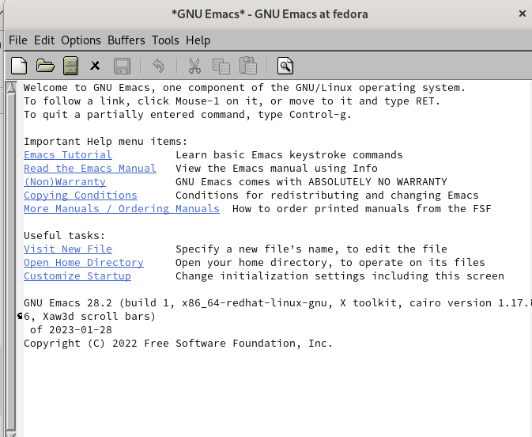{#fig:001 width=90%}

##

2. Создалим файл lab07.sh с помощью комбинации Ctrl-x Ctrl-f (C-x C-f)

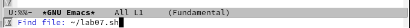{#fig:002 width=90%}

##

3. Наберем текст и сохраним файл с помощью комбинации Ctrl-x Ctrl-s (C-x C-s).

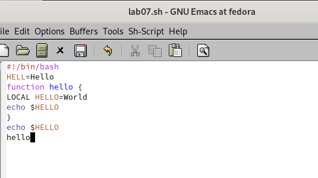{#fig:003 width=90%}

##

4. Проделать с текстом стандартные процедуры редактирования, каждое действие должно осуществляться комбинацией клавиш.Вырежем одной командой целую строку (С-k).Вставим эту строку в конец файла (C-y).

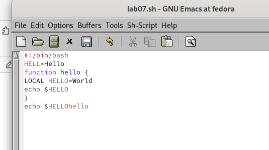{#fig:004 width=90%}

##

5. Выделим область текста (C-space) и скопируем область в буфер обмена (M-w).Вставим область в конец файла. Вновь выделим эту область и на этот раз вырезать её (C-w). Отменим последнее действие (C-/)

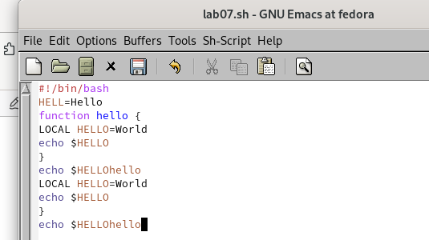{#fig:005 width=90%}

##

6. Научимся использовать команды по перемещению курсора.Переместим курсор в начало строки (C-a).

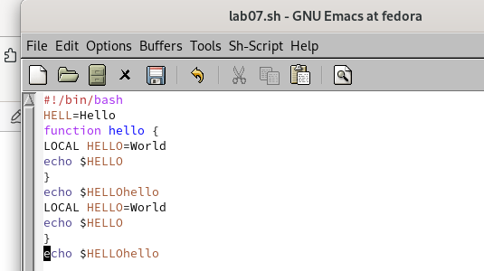{#fig:006 width=90%}

##

Переместите курсор в конец строки (C-e).

{#fig:007 width=90%}

##

7. Управление буферами. Выведем список активных буферов на экран (C-x C-b).

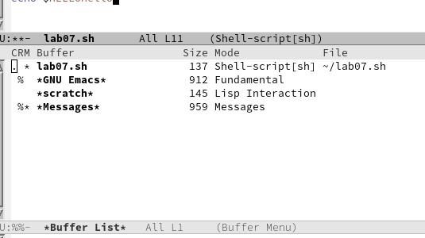{#fig:008 width=90%}

##

8. Переместимся во вновь открытое окно (C-x) o со списком открытых буферов и переключимся на другой буфер.Закроем это окно (C-x 0).

##

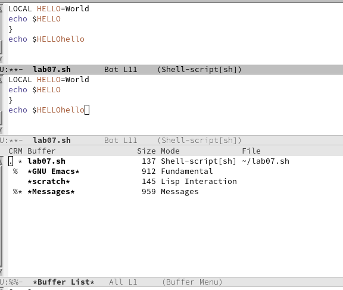{#fig:009 width=90%}

##

Теперь вновь переключайтесь между буферами, но уже без вывода их списка на экран (C-x b)

##

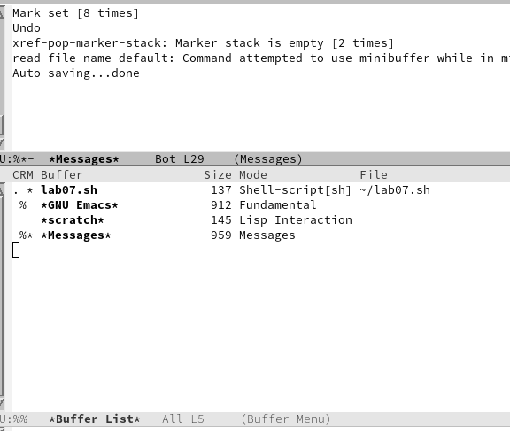{#fig:010 width=90%}

##

9. Управление окнами. Поделите фрейм на 4 части: разделите фрейм на два окна по вертикали (C-x 3), а затем каждое из этих окон на две части по горизонтали (C-x 2)

##

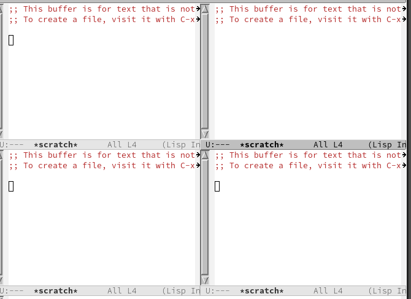{#fig:011 width=90%}

##

10. В каждом из четырёх созданных окон откроем новый буфер (файл) и введем несколько строк текста.

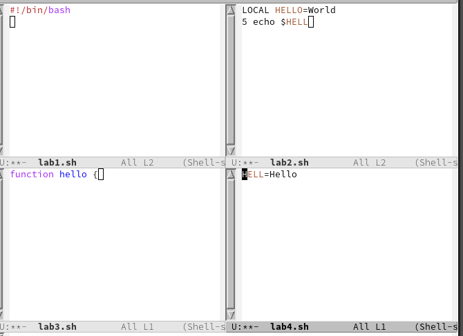{#fig:012 width=90%}

##

11. Режим поиска. Переключимся в режим поиска (C-s) и найдем несколько слов, присутствующих в тексте. Переключайтесь между результатами поиска, нажимая C-s. Выйдите из режима поиска, нажав C-g

##

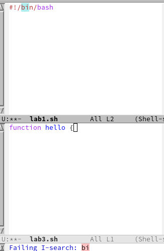{#fig:013 width=90%}

##

11. Перейдем в режим поиска и замены (M-%), введем текст, который следует найти и заменить, нажмите Enter , затем введем текст для замены. После того как будут подсвечены результаты поиска, нажмите ! для подтверждения замены. Попробуйем другой режим поиска, нажав M-s o. Он отличается от
обычного режима 

##

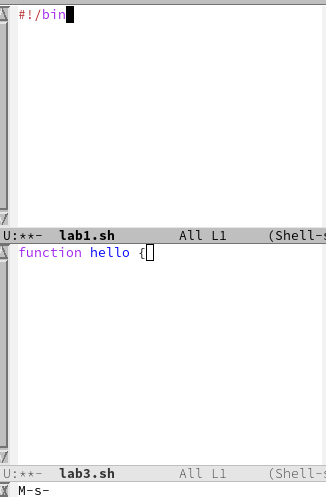{#fig:014 width=90%}

## Результаты

- Познакомились с операционной системой  
- получили практические навыки работы с редактором

## Итоговый слайд

- Запоминается последняя фраза. © Штирлиц

# Рекомендации

## Принцип 10/20/30

  - 10 слайдов
  - 20 минут на доклад
  - 30 кегль шрифта

## Связь слайдов

::: incremental

- Один слайд --- одна мысль
- Нельзя ссылаться на объекты, находящиеся на предыдущих слайдах (например, на формулы)
- Каждый слайд должен иметь заголовок

:::

## Количество сущностей

::: incremental

- Человек может одновременно помнить $7 \pm 2$ элемента
- При размещении информации на слайде старайтесь чтобы в сумме слайд содержал не более 5 элементов
- Можно группировать элементы так, чтобы визуально было не более 5 групп

:::

## Общие рекомендации

::: incremental

- На слайд выносится та информация, которая без зрительной опоры воспринимается хуже
- Слайды должны дополнять или обобщать содержание выступления или его частей, а не дублировать его
- Информация на слайдах должна быть изложена кратко, чётко и хорошо структурирована
- Слайд не должен быть перегружен графическими изображениями и текстом
- Не злоупотребляйте анимацией и переходами

:::

## Представление данных

::: incremental

- Лучше представить в виде схемы
- Менее оптимально представить в виде рисунка, графика, таблицы
- Текст используется, если все предыдущие способы отображения информации не подошли

:::

