---
## Front matter
title: "Лабораторная работа №9"
subtitle: "Операционные системы"
author: "Сабралиева Марворид Нуралиевна"

## Generic otions
lang: ru-RU
toc-title: "Содержание"

## Bibliography
bibliography: bib/cite.bib
csl: pandoc/csl/gost-r-7-0-5-2008-numeric.csl

## Pdf output format
toc: true # Table of contents
toc-depth: 2
lof: true # List of figures
lot: true # List of tables
fontsize: 12pt
linestretch: 1.5
papersize: a4
documentclass: scrreprt
## I18n polyglossia
polyglossia-lang:
  name: russian
  options:
	- spelling=modern
	- babelshorthands=true
polyglossia-otherlangs:
  name: english
## I18n babel
babel-lang: russian
babel-otherlangs: english
## Fonts
mainfont: PT Serif
romanfont: PT Serif
sansfont: PT Sans
monofont: PT Mono
mainfontoptions: Ligatures=TeX
romanfontoptions: Ligatures=TeX
sansfontoptions: Ligatures=TeX,Scale=MatchLowercase
monofontoptions: Scale=MatchLowercase,Scale=0.9
## Biblatex
biblatex: true
biblio-style: "gost-numeric"
biblatexoptions:
  - parentracker=true
  - backend=biber
  - hyperref=auto
  - language=auto
  - autolang=other*
  - citestyle=gost-numeric
## Pandoc-crossref LaTeX customization
figureTitle: "Рис."
tableTitle: "Таблица"
listingTitle: "Листинг"
lofTitle: "Список иллюстраций"
lotTitle: "Список таблиц"
lolTitle: "Листинги"
## Misc options
indent: true
header-includes:
  - \usepackage{indentfirst}
  - \usepackage{float} # keep figures where there are in the text
  - \floatplacement{figure}{H} # keep figures where there are in the text
---

# Цель работы
Познакомиться с операционной системой Linux. Получить практические навыки работы с редактором Emacs

# Выполнение лабораторной работы

1. Откроем emacs

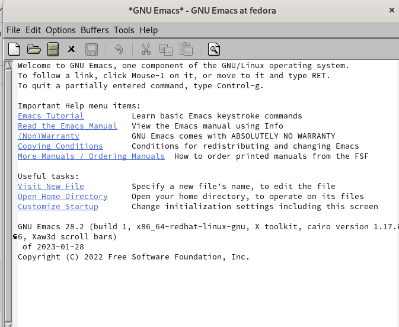{#fig:001 width=90%}

2. Создалим файл lab07.sh с помощью комбинации Ctrl-x Ctrl-f (C-x C-f)

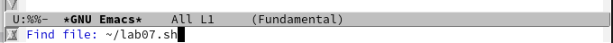{#fig:002 width=90%}

3. Наберем текст и сохраним файл с помощью комбинации Ctrl-x Ctrl-s (C-x C-s).

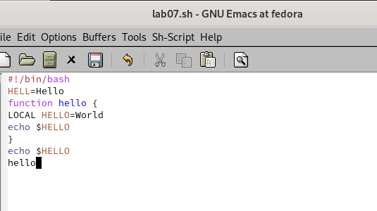{#fig:003 width=90%}

4. Проделать с текстом стандартные процедуры редактирования, каждое действие должно осуществляться комбинацией клавиш.Вырежем одной командой целую строку (С-k).Вставим эту строку в конец файла (C-y).

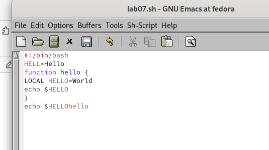{#fig:004 width=90%}

5. Выделим область текста (C-space) и скопируем область в буфер обмена (M-w).Вставим область в конец файла. Вновь выделим эту область и на этот раз вырезать её (C-w). Отменим последнее действие (C-/)

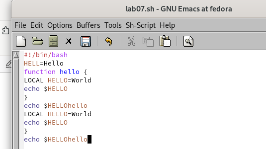{#fig:005 width=90%}

6. Научимся использовать команды по перемещению курсора.Переместим курсор в начало строки (C-a).

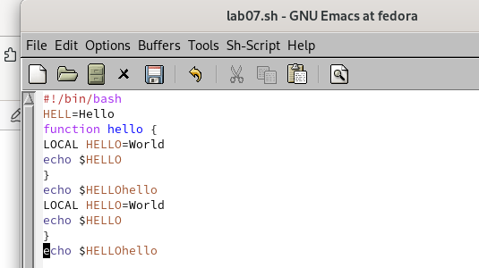{#fig:006 width=90%}

Переместите курсор в конец строки (C-e).

{#fig:007 width=90%}

7. Управление буферами. Выведем список активных буферов на экран (C-x C-b).

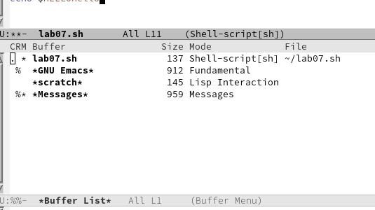{#fig:008 width=90%}

8. Переместимся во вновь открытое окно (C-x) o со списком открытых буферов и переключимся на другой буфер.Закроем это окно (C-x 0).

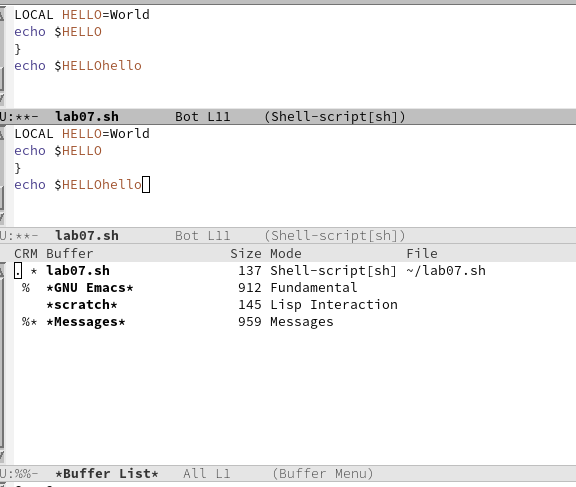{#fig:009 width=90%}

Теперь вновь переключайтесь между буферами, но уже без вывода их списка на экран (C-x b)

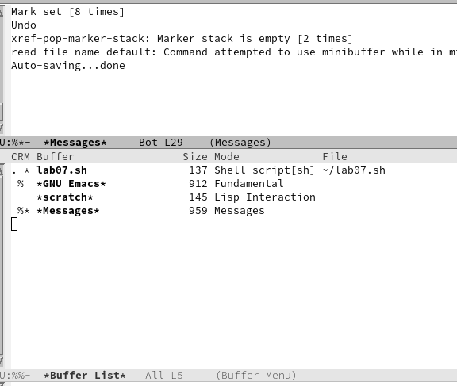{#fig:010 width=90%}

8. Управление окнами.
8.1. Поделите фрейм на 4 части: разделите фрейм на два окна по вертикали (C-x 3), а затем каждое из этих окон на две части по горизонтали (C-x 2)

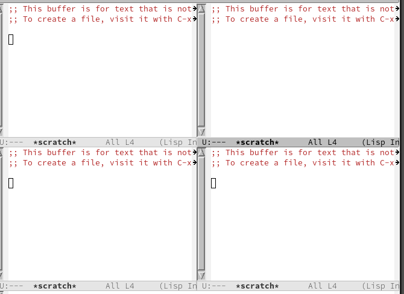{#fig:011 width=90%}

9. В каждом из четырёх созданных окон откроем новый буфер (файл) и введем несколько строк текста.

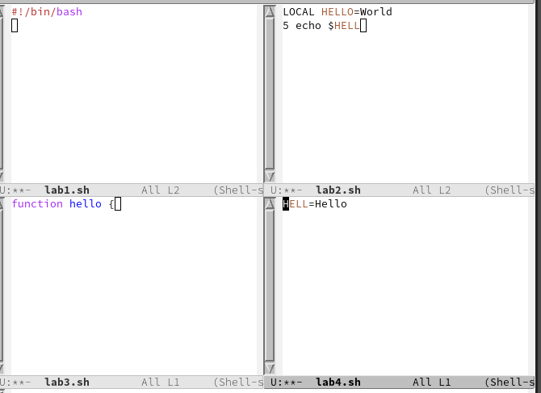{#fig:012 width=90%}

10. Режим поиска. Переключимся в режим поиска (C-s) и найдем несколько слов, присутствующих в тексте. Переключайтесь между результатами поиска, нажимая C-s. Выйдите из режима поиска, нажав C-g

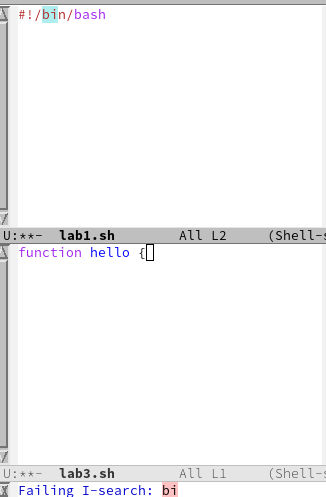{#fig:013 width=90%}

11. Перейдем в режим поиска и замены (M-%), введем текст, который следует найти и заменить, нажмите Enter , затем введем текст для замены. После того как будут подсвечены результаты поиска, нажмите ! для подтверждения замены. Попробуйем другой режим поиска, нажав M-s o. Он отличается от
обычного режима 

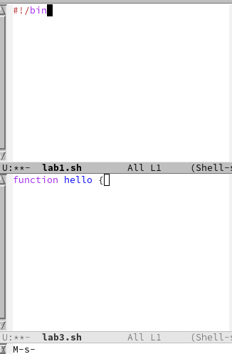{#fig:014 width=90%}

# Выводы

Мы познакомились с операционной системой Linux и получили практические навыки работы с редактором emacs.

# Контрольные вопросы

Контрольные вопросы:
1. Кратко охарактеризуйте редактор emacs. Ответ: Emacs представляет собой
мощный экранный редактор текста, написанный на языке высокого уровня
Elisp.

2. Какие особенности данного редактора могут сделать его сложным для освоения новичком? Ответ: Сложным освоение данной программы для новичка
может сделать незнание комбинации клавиш или английского.

3. Своими словами опишите, что такое буфер и окно в терминологии emacs’а
Ответ: Моими словами буфер это динамическая память, а окно- то, что мы
видим

4. Можно ли открыть больше 10 буферов в одном окне? Ответ: Можно если
нет ограничений на систему.

5. Какие буферы создаются по умолчанию при запуске emacs? Ответ: Буферы,
которые открываются по умолчанию: GNU Emacs, scratch, Messages, Quail
Completions

6. Какие клавиши вы нажмёте, чтобы ввести следующую комбинацию C-c | и
C-c C-|? Ответ: Сtrl+c, Shift+ и Ctrl+c Ctrl+

7. . Как поделить текущее окно на две части? Ответ: Нажать C-x 3, или C-x 2.

8. В каком файле хранятся настройки редактора emacs? Ответ: Настройки
хранятся в файле ~/.emacs.

9. Какую функцию выполняет клавиша Backspace и можно ли её переназначить? Ответ: Перемещение курсора

10. Какой редактор вам показался удобнее в работе vi или emacs? Поясните
почему. Ответ: Редактор emacs ,потому что на нем можно работать сразу с
несколькими файлами.

# Список литературы{.unnumbered}

::: {#refs}
:::
