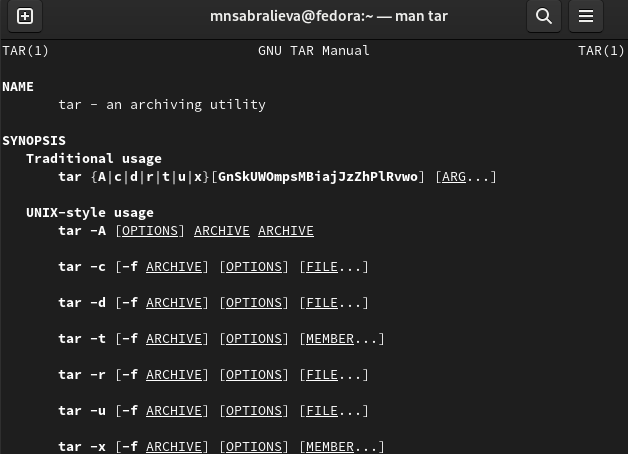

---
## Front matter
title: Лабораторная работа №10
subtitle: Операционные системы
author: Сабралиева Марворид Нуралиевна

## Generic otions
lang: ru-RU
toc-title: "Содержание"

## Bibliography
bibliography: bib/cite.bib
csl: pandoc/csl/gost-r-7-0-5-2008-numeric.csl

## Pdf output format
toc: true # Table of contents
toc-depth: 2
lof: true # List of figures
lot: true # List of tables
fontsize: 12pt
linestretch: 1.5
papersize: a4
documentclass: scrreprt
## I18n polyglossia
polyglossia-lang:
  name: russian
  options:
	- spelling=modern
	- babelshorthands=true
polyglossia-otherlangs:
  name: english
## I18n babel
babel-lang: russian
babel-otherlangs: english
## Fonts
mainfont: PT Serif
romanfont: PT Serif
sansfont: PT Sans
monofont: PT Mono
mainfontoptions: Ligatures=TeX
romanfontoptions: Ligatures=TeX
sansfontoptions: Ligatures=TeX,Scale=MatchLowercase
monofontoptions: Scale=MatchLowercase,Scale=0.9
## Biblatex
biblatex: true
biblio-style: "gost-numeric"
biblatexoptions:
  - parentracker=true
  - backend=biber
  - hyperref=auto
  - language=auto
  - autolang=other*
  - citestyle=gost-numeric
## Pandoc-crossref LaTeX customization
figureTitle: "Рис."
tableTitle: "Таблица"
listingTitle: "Листинг"
lofTitle: "Список иллюстраций"
lotTitle: "Список таблиц"
lolTitle: "Листинги"
## Misc options
indent: true
header-includes:
  - \usepackage{indentfirst}
  - \usepackage{float} # keep figures where there are in the text
  - \floatplacement{figure}{H} # keep figures where there are in the text
---

# Цель работы

Изучить основы программирования в оболочке ОС UNIX/Linux. Научиться писать
небольшие командные файлы.

# Выполнение лабораторной работы

1. Написать скрипт, который при запуске будет делать резервную копию самого себя (то
есть файла, в котором содержится его исходный код) в другую директорию backup
в вашем домашнем каталоге. При этом файл должен архивироваться одним из ар-
хиваторов на выбор zip, bzip2 или tar. Способ использования команд архивации
необходимо узнать, изучив справку.

{#fig:001 width=90%}

{#fig:002 width=90%}

{#fig:003 width=90%}

{#fig:004 width=90%}

{#fig:005 width=90%}

2. Написать пример командного файла, обрабатывающего любое произвольное число
аргументов командной строки, в том числе превышающее десять. Например, скрипт
может последовательно распечатывать значения всех переданных аргументов.
for i - для всех переданных аргументов
do echo $1 - выводим первый аргумент
shift- удаляем первый аргумент, смещаем все аргументы
done- конец цикла

{#fig:006 width=90%}

{#fig:007 width=90%}

3. Написать командный файл — аналог команды ls (без использования самой этой ко-
манды и команды dir). Требуется, чтобы он выдавал информацию о нужном каталоге
и выводил информацию о возможностях доступа к файлам этого каталога.

{#fig:008 width=90%}

4. Написать командный файл, который получает в качестве аргумента командной строки
формат файла (.txt, .doc, .jpg, .pdf и т.д.) и вычисляет количество таких файлов
в указанной директории. Путь к директории также передаётся в виде аргумента ко-
мандной строки.

{#fig:009 width=90%}

# Выводы

Мы изучили основы программирования в оболочке ОС UNIX/Linux. Научились писать
небольшие командные файлы.

# Контрольные вопросы

1. Объясните понятие командной оболочки. Приведите примеры командных
оболочек. Чем они отличаются? Ответ:
a) sh — стандартная командная оболочка UNIX/Linux, содержащая базовый,
полный набор функций
b) csh — использующая С-подобный синтаксис команд с возможностью сохранения истории выполнения команд
c) ksh — напоминает оболочку С, но операторы управления программой совместимы с операторами оболочки Борна
d) bash — сокращение от Bourne Again Shell (опять оболочка Борна), в основе
своей совмещает свойства оболочек С и Корна
2. Что такое POSIX? Ответ: POSIX (Portable Operating System Interface for
Computer Environments) — набор стандартов описания интерфейсов
взаимодействия операционной системы и прикладных программ.
3. Как определяются переменные и массивы в языке программирования bash?
Ответ: Переменные вызываются $var, где var=чему-то, указанному пользователем, неважно что бы то не было, название файла, каталога или еще
чего. Для массивов используется команда set -A
4. Каково назначение операторов let и read? Ответ: let — вычисляет далее
заданное математическое значение read — позволяет читать значения переменных со стандартного ввода
5. Какие арифметические операции можно применять в языке программирования bash? Ответ: Прибавление, умножение, вычисление, деление), сравнение значений, экспонирование и др.
6. Что означает операция (( ))? Ответ: Это обозначение используется для облегчения программирования для условий bash
7. Какие стандартные имена переменных Вам известны? Ответ: Нам известны
HOME, PATH, BASH, ENV, PWD, UID, OLDPWD, PPID, GROUPS, OSTYPE, PS1 -
PS4, LANG, HOSTFILE, MAIL, TERM, LOGNAME, USERNAME, IFS и др.
8. Что такое метасимволы? Ответ: Метасимволы это специальные знаки, которые могут использоваться для сокращения пути, поиска объекта по расширению, перед переменными, например «$» или «*» .
9. Как экранировать метасимволы? Ответ: Добавить перед метасимволом
метасимвол «»
10. Как создавать и запускать командные файлы? Ответ: При помощи команды
chmod. Надо дать права на запуск chmod +x название файла, затем запустить
bash ./название файла Например у нас файл lab Пишем: chmod +x lab ./lab
11. Как определяются функции в языке программирования bash? Ответ: Объединяя несколько команд с помощью function
12 Каким образом можно выяснить, является файл каталогом или обычным
файлом? Ответ: Можно задать команду на проверку диретория ли это test -d
директория
13 Каково назначение команд set, typeset и unset? Ответ: Set — используется
для создания массивов Unset — используется для изъятия переменной Typeset —
используется для присваивания каких-либо функций
14. Как передаются параметры в командные файлы? Ответ: Добавлением аршументов после команды запуска bash скрипта
15. Назовите специальные переменные языка bash и их назначение. Ответ:
– $* — отображается вся командная строка или параметры оболочки;
– $? — код завершения последней выполненной команды;
– $$ — уникальный идентификатор процесса, в рамках которого выполняется– $! — номер процесса, в рамках которого выполняется последняя вызванна– $- — значение флагов командного процессора;
# Список литературы{.unnumbered}

::: {#refs}
:::
