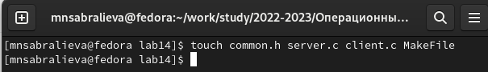
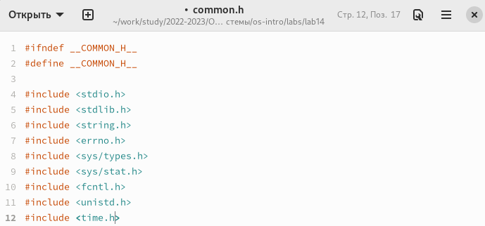
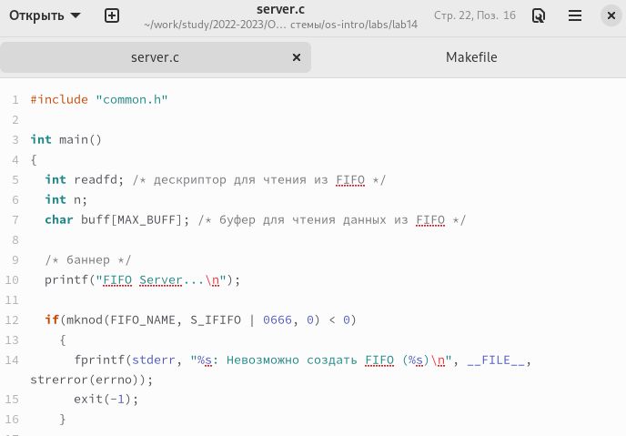
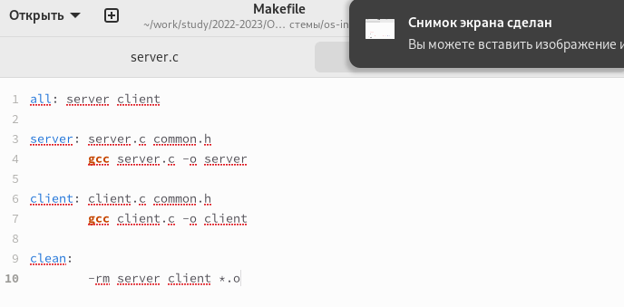
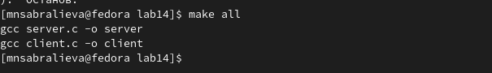
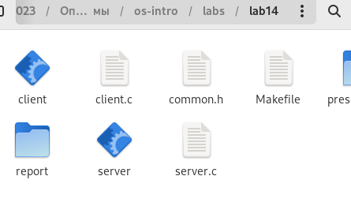
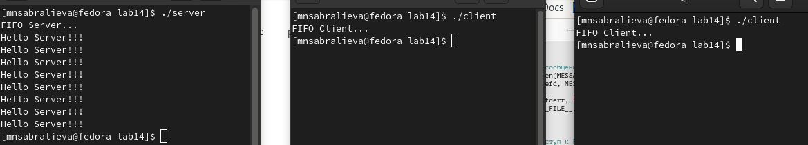

---
## Front matter
lang: ru-RU
title: Лабораторная работа №14
subtitle: Операционные системы
author:
  - Сабралиева М. Н.
institute:
  - Российский университет дружбы народов, Москва, Россия

## i18n babel
babel-lang: russian
babel-otherlangs: english

## Formatting pdf
toc: false
toc-title: Содержание
slide_level: 2
aspectratio: 169
section-titles: true
theme: metropolis
header-includes:
 - \metroset{progressbar=frametitle,sectionpage=progressbar,numbering=fraction}
 - '\makeatletter'
 - '\beamer@ignorenonframefalse'
 - '\makeatother'
---

# Информация

## Докладчик

:::::::::::::: {.columns align=center}
::: {.column width="70%"}

  * Сабралиева Марворид Нуралиевна
  * студентка НБИбд-02-22 кафедры прикладной информатики и теории вероятностей
  * Российский университет дружбы народов

:::
::::::::::::::


## Код для формата `pdf`

```yaml
slide_level: 2
aspectratio: 169
section-titles: true
theme: metropolis
```

## Код для формата `html`

- Тема задаётся в файле `Makefile`

```make
REVEALJS_THEME = beige 
```

# Элементы презентации


## Цели и задачи

- Приобретение практических навыков работы с именованными каналами.

## Содержание исследования

- Изучив приведённые в тексте программы server.c и client.c. Взяв данные примеры
за образец, мы написали аналогичные программы, внеся следующие изменения:
1.Работает не 1 клиент, а несколько (например, два).
2.Клиенты передают текущее время с некоторой периодичностью (например, раз в пять секунд). Используем функцию sleep() для приостановки работы клиента.
3.Сервер работает не бесконечно, а прекращает работу через некоторое время (например, 30 сек). Используем функцию clock() для определения времени работы сервер

##

1. Создадим файлы

{#fig:001 width=90%}

##

2. Напишем преобразованные программы в файлы 

{#fig:002 width=90%}

##

{#fig:003 width=90%}

##

{#fig:004 width=90%}

##

3. Скомпилируем файлы и проверим что вышло 

{#fig:005 width=90%}

##

{#fig:006 width=90%}

##

4. Проверим работу программ 

{#fig:007 width=90%}

## Результаты

- Приобрели практические навыки работы с именованными каналами.

## Итоговый слайд

- Запоминается последняя фраза. © Штирлиц

:::

