---
## Front matter
lang: ru-RU
title: Индивидуальный проект часть 1
subtitle: Операционные системы
author:
  - Сабралиева М.Н.
institute:
  - Российский университет дружбы народов, Москва, Россия
date: 25 февраля 2023

## i18n babel
babel-lang: russian
babel-otherlangs: english

## Formatting pdf
toc: false
toc-title: Содержание
slide_level: 2
aspectratio: 169
section-titles: true
theme: metropolis
header-includes:
 - \metroset{progressbar=frametitle,sectionpage=progressbar,numbering=fraction}
 - '\makeatletter'
 - '\beamer@ignorenonframefalse'
 - '\makeatother'
---

# Информация

## Докладчик

:::::::::::::: {.columns align=center}
::: {.column width="70%"}

  * Сабралиева Марворид Нуралиевна
  * студентка первого курса направления бизнес-инфортматика
  * Российский университет дружбы народов

:::
::: {.column width="30%"}

:::
::::::::::::::

# Вводная часть

## Актуальность
Умение создавать сайт

## Объект и предмет исследования

- Презентация как текст
- Программное обеспечение для создания презентаций
- Входные и выходные форматы презентаций

## Цели и задачи

- Установить необходимое программное обеспечение.
- Скачать шаблон темы сайта.
- Разместить его на хостинге git.
- Установить параметр для URLs сайта.
- Разместить заготовку сайта на Github pages

## Материалы и методы

- Процессор `pandoc` для входного формата Markdown
- Результирующие форматы
	- `pdf`
	- `html`
- Автоматизация процесса создания: `Makefile`

# Создание презентации

## Процессор `pandoc`

- Pandoc: преобразователь текстовых файлов
- Сайт: <https://pandoc.org/>
- Репозиторий: <https://github.com/jgm/pandoc>

## Формат `pdf`

- Использование LaTeX
- Пакет для презентации: [beamer](https://ctan.org/pkg/beamer)
- Тема оформления: `metropolis`

## Код для формата `pdf`

```yaml
slide_level: 2
aspectratio: 169
section-titles: true
theme: metropolis
```

## Формат `html`

- Используется фреймворк [reveal.js](https://revealjs.com/)
- Используется [тема](https://revealjs.com/themes/) `beige`

## Код для формата `html`

- Тема задаётся в файле `Makefile`

```make
REVEALJS_THEME = beige 
```
# Результаты

## Получающиеся форматы

- Полученный `pdf`-файл можно демонстрировать в любой программе просмотра `pdf`
- Полученный `html`-файл содержит в себе все ресурсы: изображения, css, скрипты

# Элементы презентации


## Цели и задачи

- Создать основу для будущего сайта

## Материалы и методы

- Представляйте данные качественно
- Количественно, только если крайне необходимо
- Излишние детали не нужны

## Содержание исследования

1. Скачиваем архив hugo с репозитория(рис. @fig:001).

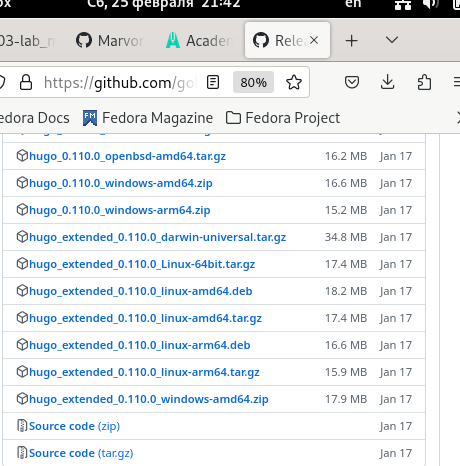{#fig:001 width=90%}

##
2. В качестве шаблона индивидуального сайта используем шаблон Hugo Academic Theme. Используя шаблон создадим репозиторий под названием blog (рис. @fig:002).

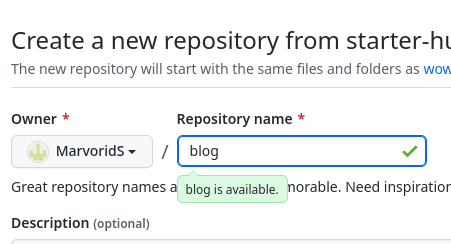{#fig:002 width=90%}

##
3. Клонируем репозиторий в консоль, тем самым копируя катологи и файлы из репозитория и проверяем что получилось  (рис. @fig:003).

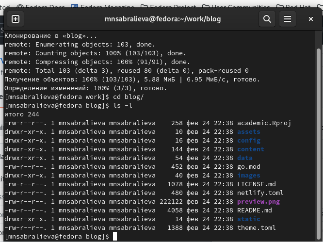{#fig:003 width=90%}

##
4. выполняем команду bin hugo  (рис. @fig:004).

{#fig:004 width=90%}

##
5. удалим папку public (рис. @fig:005).

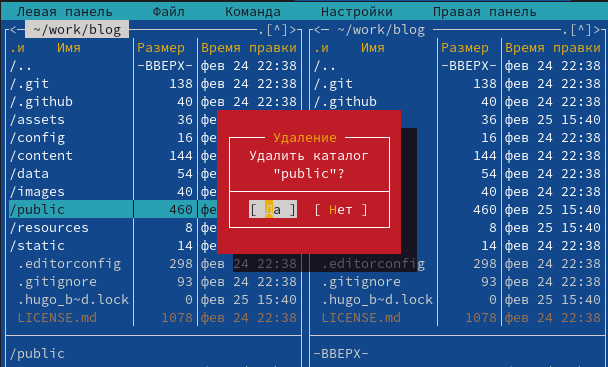{#fig:005 width=90%}

##
6. выполняем команду hugo server (рис. @fig:006).

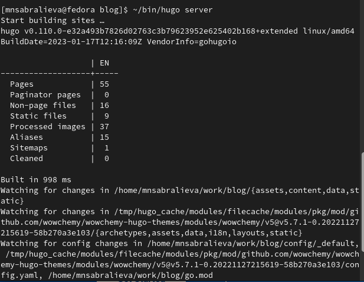{#fig:006 width=90%}

##
7. Создаем еще один репозиторий (рис. @fig:007).

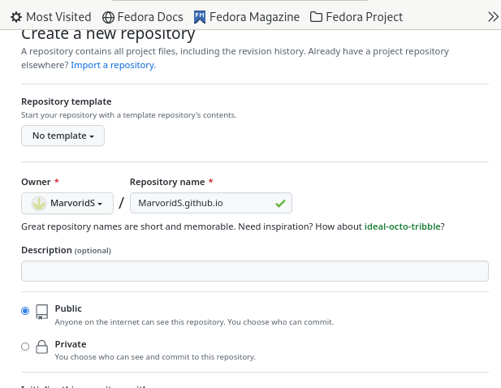{#fig:007 width=90%}

##
8. Поднимаемся на уровень выше (рис. @fig:008).

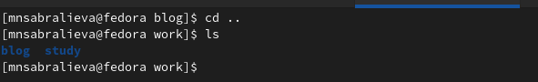{#fig:008 width=90%}

##
9. Клонируем сюда репозиторий (рис. @fig:009).

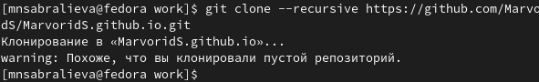{#fig:009 width=90%}

##
10. Переходим в каталог который мы скопировали и создаем ветку (рис. @fig:010).

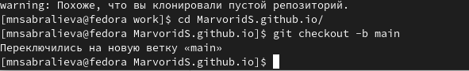{#fig:010 width=90%}

##
11. Создаем в этой ветке файл (рис. @fig:011).

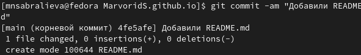{#fig:011 width=90%}

##
12. синхронизируем с репозиторием (рис. @fig:012).

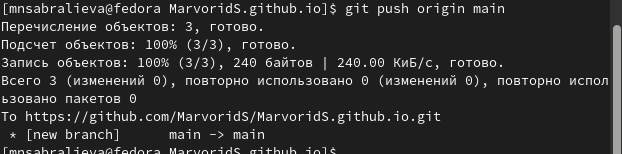{#fig:012 width=90%}

##
13. проверяем что у нас получилось (рис. @fig:013).

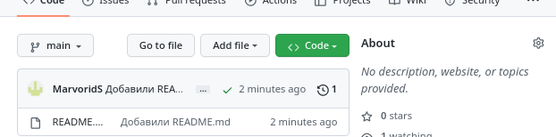{#fig:013 width=90%}

##
14. вернемся в папку блог (рис. @fig:014).

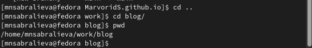{#fig:014 width=90%}

##
15. подключим репозиторий к папке блог (рис. @fig:015).

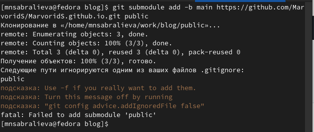{#fig:015 width=90%}

##
16. Папка public игнорируется поэтому с помощью мс исправим код (рис. @fig:016).

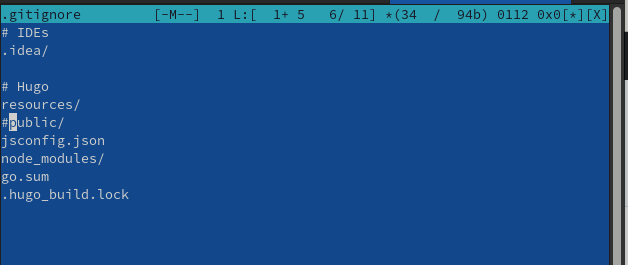{#fig:016 width=90%}

##
17. с помощью сат проверяем что вышло (рис. @fig:017).

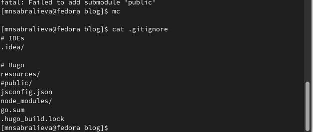{#fig:017 width=90%}

##
18. повторим команду и видим что добавляется индекс (рис. @fig:018).

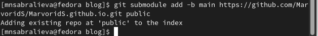{#fig:018 width=90%}

##
19. используем команду хуго и видим что в папку public добавляются файлы (рис. @fig:019).

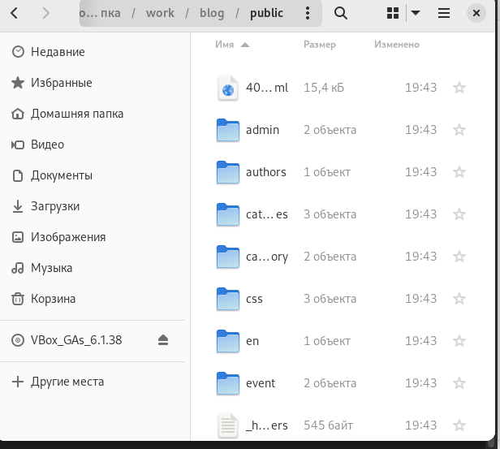{#fig:019 width=90%}

##
20. синхронизируем файлы с репозиторием (рис. @fig:020).

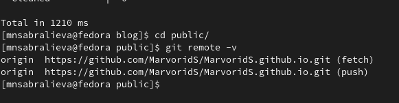{#fig:020 width=90%}

(рис. @fig:021).

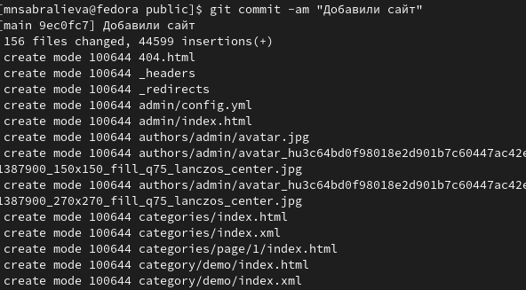{#fig:021 width=90%}

##
21. Обновляем репозиторий и видим что появились все файлы (рис. @fig:022).

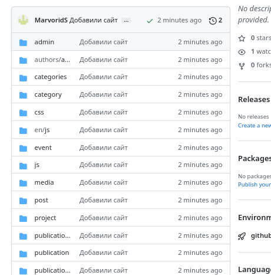{#fig:022 width=90%}

## Результаты

Мы создали основу для нашего сайта

## Итоговый слайд

- Запоминается последняя фраза. © Штирлиц

# Рекомендации


:::

