---
## Front matter
title: "Индивидуальный проект часть 1"
subtitle: "Операционные системы"
author: "Сабралиева Марворид Нуралиевна"

## Generic otions
lang: ru-RU
toc-title: "Содержание"

## Bibliography
bibliography: bib/cite.bib
csl: pandoc/csl/gost-r-7-0-5-2008-numeric.csl

## Pdf output format
toc: true # Table of contents
toc-depth: 2
lof: true # List of figures
lot: true # List of tables
fontsize: 12pt
linestretch: 1.5
papersize: a4
documentclass: scrreprt
## I18n polyglossia
polyglossia-lang:
  name: russian
  options:
	- spelling=modern
	- babelshorthands=true
polyglossia-otherlangs:
  name: english
## I18n babel
babel-lang: russian
babel-otherlangs: english
## Fonts
mainfont: PT Serif
romanfont: PT Serif
sansfont: PT Sans
monofont: PT Mono
mainfontoptions: Ligatures=TeX
romanfontoptions: Ligatures=TeX
sansfontoptions: Ligatures=TeX,Scale=MatchLowercase
monofontoptions: Scale=MatchLowercase,Scale=0.9
## Biblatex
biblatex: true
biblio-style: "gost-numeric"
biblatexoptions:
  - parentracker=true
  - backend=biber
  - hyperref=auto
  - language=auto
  - autolang=other*
  - citestyle=gost-numeric
## Pandoc-crossref LaTeX customization
figureTitle: "Рис."
tableTitle: "Таблица"
listingTitle: "Листинг"
lofTitle: "Список иллюстраций"
lotTitle: "Список таблиц"
lolTitle: "Листинги"
## Misc options
indent: true
header-includes:
  - \usepackage{indentfirst}
  - \usepackage{float} # keep figures where there are in the text
  - \floatplacement{figure}{H} # keep figures where there are in the text
---

# Цель работы
Размещение на Github pages заготовки для персонального сайта.

# Задание

- Установить необходимое программное обеспечение.
- Скачать шаблон темы сайта.
- Разместить его на хостинге git.
- Установить параметр для URLs сайта.
- Разместить заготовку сайта на Github pages

# Выполнение лабораторной работы

1. Скачиваем архив hugo с репозитория(рис. @fig:001).

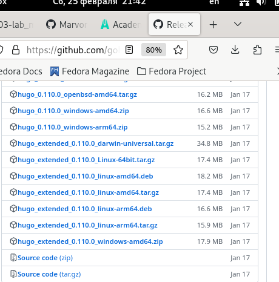{#fig:001 width=90%}

2. В качестве шаблона индивидуального сайта используем шаблон Hugo Academic Theme. Используя шаблон создадим репозиторий под названием blog (рис. @fig:002).

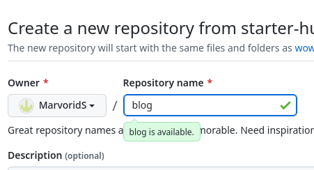{#fig:002 width=90%}

3. Клонируем репозиторий в консоль, тем самым копируя катологи и файлы из репозитория и проверяем что получилось  (рис. @fig:003).

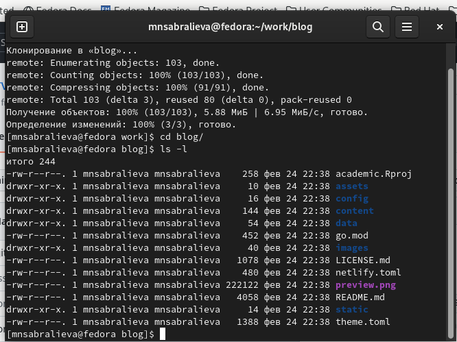{#fig:003 width=90%}

4. выполняем команду bin hugo  (рис. @fig:004).

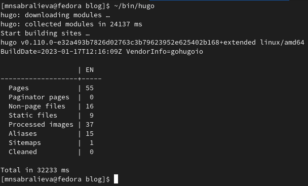{#fig:004 width=90%}

5. удалим папку public (рис. @fig:005).

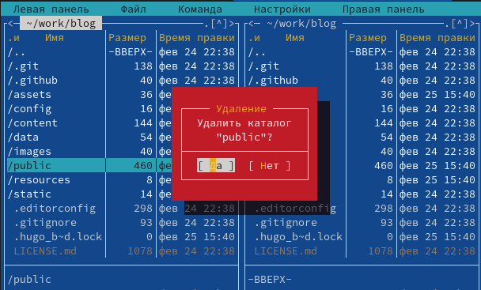{#fig:005 width=90%}

6. выполняем команду hugo server (рис. @fig:006).

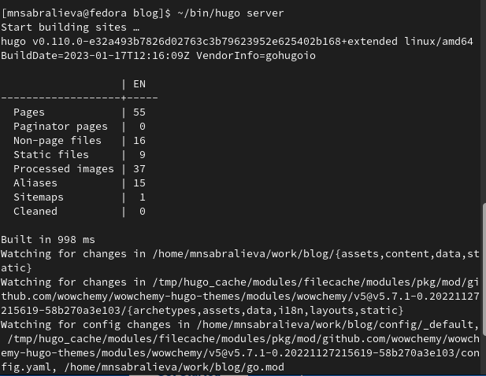{#fig:006 width=90%}

7. Создаем еще один репозиторий (рис. @fig:007).

{#fig:007 width=90%}

8. Поднимаемся на уровень выше (рис. @fig:008).

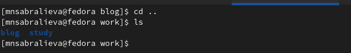{#fig:008 width=90%}

9. Клонируем сюда репозиторий (рис. @fig:009).

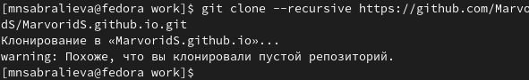{#fig:009 width=90%}

10. Переходим в каталог который мы скопировали и создаем ветку (рис. @fig:010).

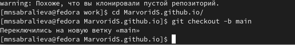{#fig:010 width=90%}

11. Создаем в этой ветке файл (рис. @fig:011).

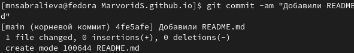{#fig:011 width=90%}

12. синхронизируем с репозиторием (рис. @fig:012).

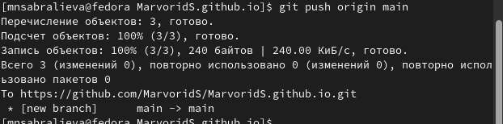{#fig:012 width=90%}

13. проверяем что у нас получилось (рис. @fig:013).

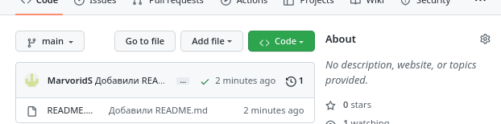{#fig:013 width=90%}

14. вернемся в папку блог (рис. @fig:014).

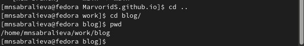{#fig:014 width=90%}

15. подключим репозиторий к папке блог (рис. @fig:015).

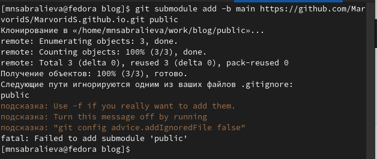{#fig:015 width=90%}

16. Папка public игнорируется поэтому с помощью мс исправим код (рис. @fig:016).

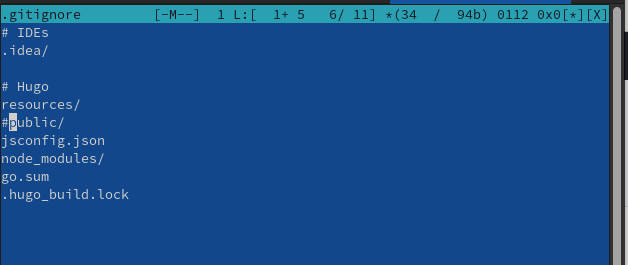{#fig:016 width=90%}

17. с помощью сат проверяем что вышло (рис. @fig:017).

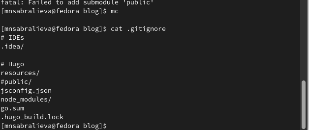{#fig:017 width=90%}

18. повторим команду и видим что добавляется индекс (рис. @fig:018).

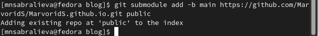{#fig:018 width=90%}

19. используем команду хуго и видим что в папку public добавляются файлы (рис. @fig:019).

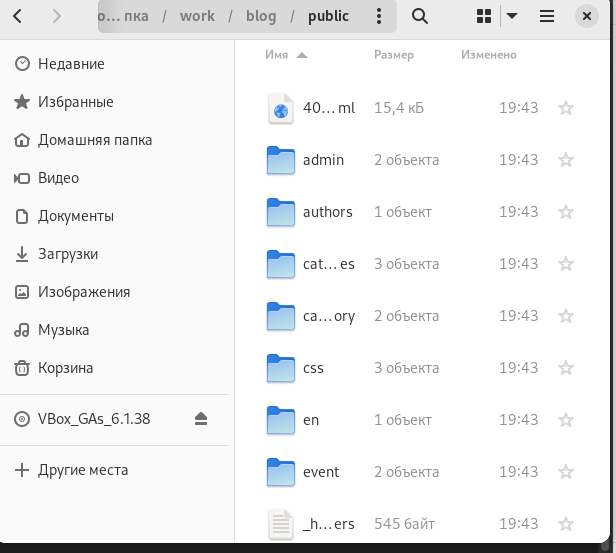{#fig:019 width=90%}

20. синхронизируем файлы с репозиторием (рис. @fig:020).

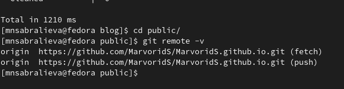{#fig:020 width=90%}

(рис. @fig:021).

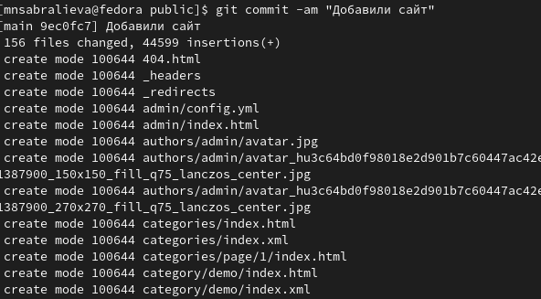{#fig:021 width=90%}

21. Обновляем репозиторий и видим что появились все файлы (рис. @fig:022).

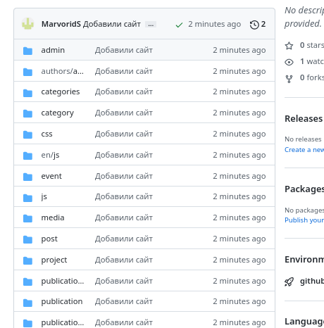{#fig:022 width=90%}

# Выводы

Мы подготовили основу нашего сайта и выполнили первую часть проекта

# Список литературы{.unnumbered}

::: {#refs}
:::
