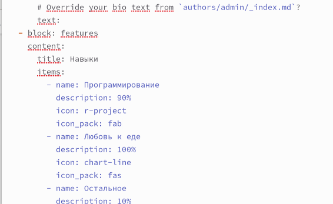
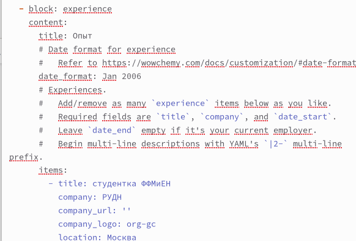
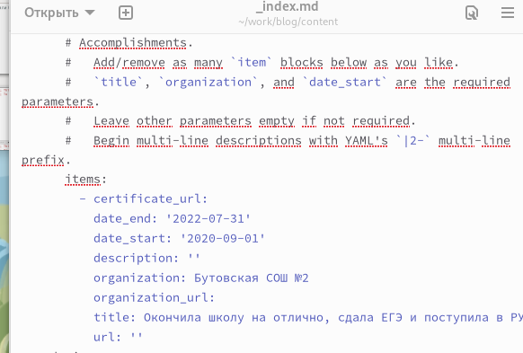
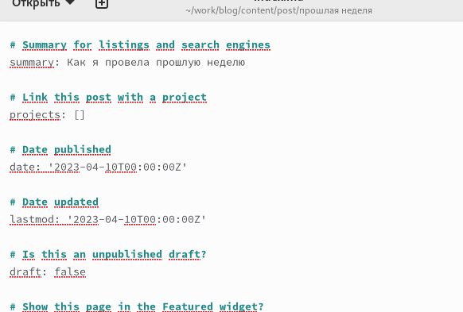
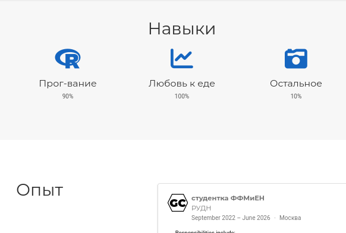
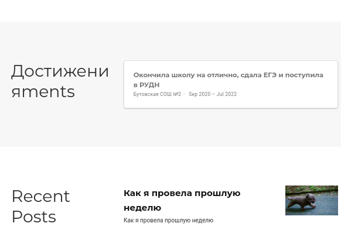

---
## Front matter
lang: ru-RU
title: Индивидуальный проект часть 3
subtitle: Операционные системы
author:
  - Сабралиева М. Н.
institute:
  - Российский университет дружбы народов, Москва, Россия

## i18n babel
babel-lang: russian
babel-otherlangs: english

## Formatting pdf
toc: false
toc-title: Содержание
slide_level: 2
aspectratio: 169
section-titles: true
theme: metropolis
header-includes:
 - \metroset{progressbar=frametitle,sectionpage=progressbar,numbering=fraction}
 - '\makeatletter'
 - '\beamer@ignorenonframefalse'
 - '\makeatother'
---

# Информация

## Докладчик

:::::::::::::: {.columns align=center}
::: {.column width="70%"}

  * Сабралиева Марворид Нуралиевна
  * студентка НБИбд-02-22 кафедры прикладной информатики и теории вероятностей
  * Российский университет дружбы народов


:::
::::::::::::::


## Код для формата `pdf`

```yaml
slide_level: 2
aspectratio: 169
section-titles: true
theme: metropolis
```

## Код для формата `html`

- Тема задаётся в файле `Makefile`

```make
REVEALJS_THEME = beige 
```
# Элементы презентации

## Цели и задачи

- Добавить к сайту достижения.

## Содержание исследования

1. Добавим информацию о навыках 

{#fig:001 width=90%}

##

2. Добавим информацию об опыте (Experience).

{#fig:002 width=90%}

##

3. Добавим информацию о достижениях (Accomplishments).

{#fig:003 width=90%}

##

4. Сделаем пост по прошедшей неделе.

{#fig:004 width=90%}

##

{#fig:005 width=90%}

##

{#fig:006 width=90%}

## Результаты

- Не нужны все результаты
- Необходимы логические связки между слайдами
- Необходимо показать понимание материала


## Итоговый слайд

- Запоминается последняя фраза. © Штирлиц


:::

